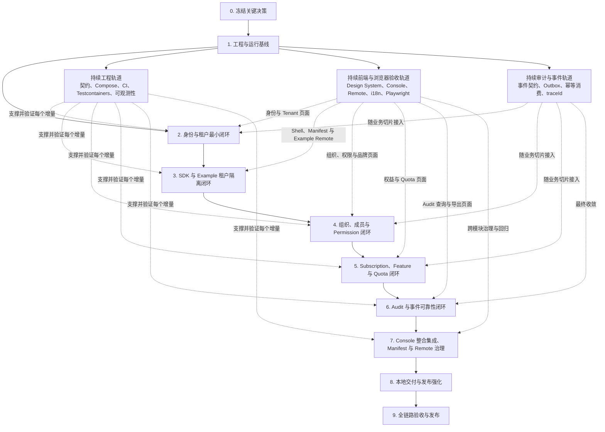

# MVP 开发计划清单

> **状态**：本文是设计基线，描述长期有效的目标与约束，不代表对应功能已实现；当前实现状态见 [README 的当前状态](../README.md#当前状态) 与开放 Issues。涉及前端界面的部分写作于自建 Design System / React Shell 时期，已由 [ADR 0050](adr/0050-consoles-adopt-soybean-element-plus.md) 替代；现行实现是 Vue 3 + Element Plus + Soybean Admin。勾选项只表示当时该条目的证据成立，**不表示当前仍可直接复用**；引用已删除包、依赖或浏览器矩阵的历史证据按原事实保留。

## 目标、边界与当前起点

本计划以 [产品范围](01-product-scope.md) 定义的 MVP 闭环为验收目标：

```text
部署平台 → 平台管理员配置权益 → 创建租户和订阅 → 初始化租户管理员
→ 租户管理员管理组织、成员和角色 → Project SaaS 接入 SDK
→ Tenant Context、Permission、Feature、Quota 校验 → 执行业务 → 审计可查询
```

当前仓库已完成第 1、2 阶段的大部分后端契约、服务、数据、安全与诊断型端到端切片；两个 Console 已切换为 Vue 3 + Element Plus（[ADR 0050](adr/0050-consoles-adopt-soybean-element-plus.md)），共享认证已实现登录、首次改密、刷新、恢复、登出与 Tenant 选择/切换，并有真实受信 HTTPS 浏览器证据，见 [Browser Session 安全验收记录](acceptance/issue-158-browser-session-security.md)。Platform 侧已交付 Tenant 创建与生命周期、管理员初始化与密码投递、Plan、Quota Definition、Subscription 与 OAuth Client 管理页面；Tenant 侧仍只有工作台，Organization、通用 RBAC 目录、Invitation 激活、Feature 运行时闭环、Audit 查询与导出、业务 Remote 均未实现。局部认证证据不代表本计划完整产品与浏览器闭环通过：第 2 阶段主链的绿色证据基线早于 Vue 切换，需按 [Issue #184](acceptance/issue-184-stage2-main-chain.md) 的时效边界重跑。Gateway 的 Password Setup 静态页不能替代最终 Console 产品路径。原有后端勾选保留，未完成专项验收的 Console 与浏览器事项保持未完成。

MVP 不包含完整支付/账单/发票、公共注册和外部身份源、多语言 SDK、Schema Per Tenant 或 Database Per Tenant 隔离、CLI，以及 Helm/systemd 的完整生产交付。后两项在架构与配置上保持兼容，但不在 MVP 发布阻塞项范围内；MVP 之后的去向见本文「MVP 后续项」与 [路线图](15-roadmap.md) 的 H1/H2。

本文不包含工期或人员估算；现有文档未提供团队规模、可用工时或交付日期，不能据此给出可验证的排期。

## MVP 完成定义

- 本地执行 Docker Compose 后，可访问 Platform Console、Tenant Console Shell、官方 Project SaaS Example 与全部运行依赖。**Example 与对象存储尚未实现**，`examples/` 当前只有 README。
- 平台管理员可创建 Feature、Quota Definition、Plan、Tenant、Subscription，并为租户初始化管理员。Tenant 创建/生命周期、Plan、Quota Definition、Subscription 与管理员初始化已实现；**Feature 定义与运行时闭环未实现**。
- 租户管理员可创建组织、邀请并激活成员、创建租户角色、授权 Permission；平台角色与租户角色互不越权。**Organization、Invitation 激活与通用 Permission 目录未实现**；已实现的是 Tenant 内静态角色与角色绑定。
- Example 的业务 API 只能通过 Java SDK/Starter 获取可信 Tenant Context，并同时正确执行 Permission、Feature 与 Quota 校验；不同租户的数据经应用层和 PostgreSQL RLS 双重隔离。
- 登录、租户切换、授权/权益拒绝、配额操作和关键业务操作产生可查询审计记录。**审计查询与导出未实现**；已实现的是成功事实消费与只追加审计记录。
- 第 1～6 阶段分别交付对应的最终产品页面，并从全新 Compose 数据卷通过真实 Console、Gateway、服务和运行依赖完成核心成功与重要拒绝/恢复路径；接口调用、Mock、生成 Client 或 curl E2E 不能单独证明阶段产品闭环完成。
- Platform Console、Tenant Console Shell 与业务 Remote 共享同一 UI 载体（`@saas-forge/admin`）、认证/HTTP/错误语义和中英文国际化基线；相同场景不得出现无领域依据的样式或操作逻辑差异。**业务 Remote 尚未实现**。
- `./mvnw verify`、契约、集成、端到端、安全、性能与质量门禁全部通过，具体门禁见“9. 全链路验收与 MVP 发布门禁”。


## 实施顺序与依赖

实施采用纵向闭环，而不是先分别完成四个服务、最后再集成。每个阶段都必须在 Compose 环境中形成可运行、可测试的增量；契约、数据库迁移、CI、可观测性、审计和事件可靠性随业务切片持续演进。




阶段之间的主要依赖如下：

- IAM 与 Tenant Access 在第 2 阶段共同交付登录、Membership 校验、Tenant 切换和管理员初始化，不能按两个完全独立服务串行实施。
- SDK 可在公开契约稳定后生成客户端骨架，但其认证、Tenant Context、Permission、Feature、Quota 与 Audit 能力分别在第 3～6 阶段随服务端闭环完成。
- Gateway、Compose、CI、Testcontainers 和基础可观测性从第 1 阶段开始建设，并在后续阶段持续增强。
- 最终产品 Console 随对应公开 API 在第 1～6 阶段持续交付；第 7 阶段只负责完整 Shell、Manifest、Remote 治理和跨模块集成，不得成为前端首次实现阶段。
- 每个阶段分别维护“领域与服务”“Console 交互”“浏览器验收”事项。已有后端直接证据不因新增前端要求失效，但只有三类事项都完成，阶段才算实际完成。
- 每个阶段的最高验收缝是：从全新 Compose 数据卷启动真实 Console、Gateway、领域服务、PostgreSQL、Redis、Kafka 及该阶段所需的其他依赖，再由 Playwright 验证核心成功路径和重要拒绝/恢复路径。curl E2E 保留为后端诊断证据，不能替代浏览器验收。


## 开发清单


### 0. 关键决策冻结

- [x] 评审并记录 Tenant、Subscription、Plan、Feature、Quota、Invitation 的枚举、允许状态迁移、幂等与错误码；实现必须遵循[核心领域契约](17-core-domain-contracts.md)。
- [x] 将 MVP Quota 限定为 `max_users` 与 `max_projects`，决定计量单位、`check`/`consume`/`release` 的结果语义、失败补偿规则和并发扣减策略；其他计量类型不阻塞核心闭环。
- [x] 决定首个 Platform Admin 的安全初始化方式、开发与生产的 JWT 私钥/KMS 接入方式，以及初始凭据轮换流程；见 [ADR 0007](adr/0007-system-creates-the-default-platform-admin.md)、[ADR 0008](adr/0008-production-jwt-signing-uses-kms.md) 与[安全设计](12-security-design.md)。
- [x] 确认 Platform Console、Tenant Console Shell、业务 Remote 的最终域名拓扑，从而确定 Cookie `SameSite`、CSRF 方案和 CORS 白名单；见 [ADR 0009](adr/0009-browser-surfaces-use-controlled-origins.md)、[API 设计](08-api-design.md)与[安全设计](12-security-design.md)。
- [x] 明确“Tenant 创建与管理员初始化”“邀请激活”“Tenant 切换”“成员禁用/Tenant 冻结”四条跨服务流程的数据所有权、同步调用、事件、失败恢复与幂等责任；见[跨服务工作流契约](18-tenant-access-cross-service-workflows.md)、[ADR 0010](adr/0010-tenant-access-cross-service-workflows.md)与[事件契约](../saas-forge-contracts/saas-forge-event-contracts/tenant-access-workflows.md)。
- [x] 确认数据库、Redis 与应用日志规范以版本化文档和 CI 校验维护，不得以跨服务共享领域实体或数据库模型的方式实现；见[数据库设计与规范](11-database-design.md)、[Redis Key Registry](19-redis-key-registry.md)、[应用日志规范](20-application-logging.md)与[ADR 0011](adr/0011-versioned-data-cache-and-logging-standards.md)。静态门禁已接入 Maven `verify`；真实 Flyway/RLS、Redis 故障和日志输出的运行时门禁随首个相关实现同步加入。
- [x] 为影响服务边界、安全模型和公开契约的决策建立 ADR；跨服务流程见[ADR 0010](adr/0010-tenant-access-cross-service-workflows.md)，导出留存期、Manifest 审批细节等局部决策在对应阶段开始前冻结，不阻塞第 1～5 阶段。
- [x] 决定 Tenant Access 拥有受控 Tenant Brand Profile：未建立权威 Tenant Context 时完整使用 Platform Brand Profile；建立后只有当显示名称、Logo、favicon、主色与强调色整份有效时才能原子应用，否则整份回退平台品牌；Tenant 品牌不得改变统一布局、组件、状态颜色、交互语义或无障碍约束，见 [ADR 0036](adr/0036-tenant-access-owns-controlled-tenant-brand-profiles.md) 与 [ADR 0042](adr/0042-browser-surfaces-atomically-apply-one-resolved-brand.md)。

**完成标准：** 第 1～5 阶段依赖的关键决策均可追溯，不存在会改变服务边界、安全模型或公开契约的未决规则。

### 1. 工程与运行基线

**领域、契约与运行基线**

- [x] 固化 Maven Wrapper 与 JDK 17 构建（历史 JDK 21 兼容门禁现按 [ADR 0046](adr/0046-development-supports-chrome-and-jdk17.md) 退出当前支持范围）；补齐依赖版本管理、测试、覆盖率和制品发布的父 POM 约定。详见 [Maven 构建与制品发布](21-maven-build-and-release.md)与 [ADR 0012](adr/0012-maven-coordinates-use-github-namespace.md)。
- [x] **先冻结 API 通用规范，再定义任何资源接口。** [API 设计](08-api-design.md#rest-约定)已明确路径、字段和枚举命名；UUIDv7、时间、日期、金额/小数与空值的 JSON 表示；参数边界与 `POST`、`PUT`、`PATCH` 语义；过滤、排序和游标分页；文件/异步任务；版本、幂等、关联 ID 和内容协商规则。
- [x] 明确成功与失败的统一返回模型，并提供 OpenAPI 可复用 Schema 和正反例。[API 设计](08-api-design.md#成功与失败响应)已冻结直接成功表示、`201`／`202` 的 `Location`、`204` 无响应体、集合与 Job 不变式，以及 Problem Details 与字段校验语义；[OpenAPI 公共组件](../saas-forge-contracts/saas-forge-openapi-contracts/common.yaml)提供机器可读 Schema、Response、Header 和示例。
- [x] 在[租户架构](05-tenant-architecture.md#tenant-context)、[API 设计](08-api-design.md#v1-资源边界)、[SDK 设计](09-sdk-design.md#身份与上下文)和[安全设计](12-security-design.md#授权租户与数据隔离)中重申租户安全边界：用户请求不得通过请求头、查询参数、请求体或语义等价别名传入/覆盖 Tenant；此类输入以 `400` 拒绝。服务身份只用 `client_id` 与显式 `scope` 授权，不建立或伪造用户上下文；缺少所需 scope 以 `403` 拒绝。
- [x] 在 `saas-forge-contracts/saas-forge-openapi-contracts/v1.yaml` 定义实施阶段 2、3 所需的 `auth`、Tenant 管理、JWKS 以及管理员初始化所需的最小权益前置链路；第 3 阶段不需要独立 Runtime 端点。Permission、Feature、Quota Runtime 操作和后续资源契约在对应阶段开始前评审，并以兼容方式加入同一 v1 契约；决策见 [ADR 0013](adr/0013-v1-openapi-contracts-follow-delivery-prerequisites.md)。
- [x] 在 `saas-forge-contracts/saas-forge-protobuf-contracts` 定义 IAM↔Tenant Access 所需的 Membership 即时校验接口；在 `saas-forge-contracts/saas-forge-event-contracts` 定义统一 CloudEvents JSON 信封、审计事件和缓存失效事件的版本规则。
- [x] 建立 spec-first 代码生成流程：服务端 Spring MVC 接口骨架、`sdk-core` Java REST Client 与 `consoles/shared/api-client` TypeScript API Client 都由 `saas-forge-contracts/saas-forge-openapi-contracts/v1.yaml` 生成且不提交。每个 operation 以唯一 `x-saas.forge-service` 声明归属；手写 Controller 只能实现生成接口、不得自行声明 HTTP 路由；Maven `verify` 重生成并编译/类型检查全部 Client，禁止实现反向修改正式契约。决策见 [ADR 0015](adr/0015-openapi-is-the-source-of-generated-rest-code.md)。
- [x] 增加 REST、Protobuf 与事件的兼容性检查，阻止破坏性 v1 变更。
- [x] **先发布数据库建模与迁移规范，再创建业务表。** [数据库设计与规范](11-database-design.md)已覆盖表/列/索引/约束的命名，类型、可空性、默认值和时区，UUIDv7 主键，外键的服务内边界，状态/软删除/历史记录的适用规则，以及 Flyway 不可变版本、前向修复和数据回填约定。
- [x] 明确公共持久化字段的适用矩阵：独立实体默认使用 `id`，Tenant 范围表必须使用非空 `tenant_id`，`created_at`、`updated_at`、`deleted_at` 与 `status` 按数据语义使用；全局表和平台表不得为了“统一”而伪造 `tenant_id`。`created_by`、`updated_by` 等操作者字段由具体审计/查询需求逐表评审。
- [x] 保持服务领域模型私有：不创建跨服务的 `BaseEntity`、共享 MyBatis Entity 或共享数据库表。SDK 不发布持久化基类；用户仅可在自己拥有的单个服务和数据库边界内选择本地基类。跨服务共享物限于版本化契约、构建 BOM、安全和可观测性基础设施契约，并在服务边界映射为内部模型。
- [x] 为 IAM、Tenant Access、Entitlement、Audit 分别配置独立数据库账号组、Flyway 迁移链和 PostgreSQL 18 原生 `uuidv7()` 主键生成；由独立集群引导工件创建数据库、账号与 `public` Schema 最小权限，每库以 `*_migrator` 执行迁移、以非所有者且无 `BYPASSRLS` 的 `*_app` 运行服务；迁移任务成功后才启动应用，应用不自动迁移且不持有迁移账号；禁止跨服务/跨数据库表引用、外键、`JOIN`、FDW 与 `dblink`，但允许同服务同库关系；见 [ADR 0017](adr/0017-separate-flyway-and-runtime-database-accounts.md)、[ADR 0018](adr/0018-postgresql-18-native-uuidv7-primary-keys.md)、[ADR 0019](adr/0019-cluster-bootstrap-precedes-service-flyway.md)、[ADR 0020](adr/0020-flyway-runs-as-a-predeployment-job.md) 与 [ADR 0021](adr/0021-runtime-accounts-cannot-create-database-objects.md)。
- [x] 建立服务内 Transactional Outbox、可靠发布器和按事件 ID 幂等消费的统一工程约定；各服务在对应业务切片中落地自己的表和实现，事件携带并传递 `traceId`。
- [x] 建立 Tenant 范围表的 RLS 测试夹具：非空 `tenant_id`、事务级 `app.tenant_id` 设置、默认拒绝策略，常规运行账号不拥有 `BYPASSRLS`；仅 `*_migrator` 可通过角色限定维护策略执行跨 Tenant 数据回填，`*_app` 不得继承或切换至该角色；见 [ADR 0022](adr/0022-migration-roles-are-the-only-rls-maintenance-exception.md)。
- [x] **先发布 Redis Key Registry，再接入 Redis。** 为每个 Key 定义固定前缀/环境/服务/用途/版本/标识符格式、值序列化、TTL、最大基数、失效事件、单一写入所有者、读取者和故障策略；首版已覆盖 JWT `jti` 黑名单（TTL 为 Token 剩余有效期）、撤销 Signing Key `kid`、Refresh Token/会话缓存、登录保护和 Gateway 限流。Key 中禁止存放 Token、密码、Secret、邮箱等原始敏感值；Redis 不得作为 Quota 额度真相。SDK 的 Permission/Feature 默认使用进程内短缓存，业务可替换为自己的 Redis，未命中时经平台接口权威回源，不属于平台 Redis Registry。
- [x] **先发布结构化日志规范，再写业务日志。** [应用日志规范](20-application-logging.md)、[日志 Schema](../saas-forge-contracts/logging/application-log.schema.json)与[日志策略](../saas-forge-contracts/logging/policy.json)已定义基础必填和场景条件必填字段、关联字段、HTTP/异常字段、字段白名单与脱敏、级别、采样和保留类别。容器使用结构化标准输出由 Collector 收集；虚拟机以 `systemd`/日志转发收集，应用不依赖本地滚动日志文件。日志不能替代只追加的 Audit Record。
- [x] 建立包含 Gateway、四个服务、PostgreSQL、Redis、Kafka 和 OpenTelemetry Collector 的最小 Docker Compose；S3 兼容存储随第 4 阶段的受控 Tenant 品牌素材加入，第 6 阶段在分离的存储边界内复用其基础能力承载 Audit 导出。
- [x] 使用 Testcontainers 建立 PostgreSQL 18、Redis 和 Kafka 集成测试基础设施，并建立首版 GitHub Actions 构建、单元测试、契约兼容性和迁移检查；数据库门禁必须验证四库八账号、独立迁移链、运行时最小权限/RLS、数据库 UUIDv7 默认值，以及审计记录不可由 `audit_app` 修改或删除。
- [x] Gateway 提供最小路由、Problem Details 错误规范化和 W3C Trace Context 透传；鉴权、限流和来源策略在后续闭环中逐步增强。实现边界见 [ADR 0025](adr/0025-gateway-uses-spring-cloud-gateway-server-mvc.md)。

**Console 工程、共享交互与浏览器基线**

- [x] 建立最终产品形态的 Platform Console、Tenant Console Shell 与共享 Runtime；通过稳定包入口接入生成的 TypeScript API Client，形成可独立构建、发布静态制品和测试的应用 Shell，不建设一次性验收 Console。此项不证明登录、真实 API、受控 TLS Origin、Remote 或真实浏览器产品闭环。
- [x] 建立唯一共享 UI 载体（当前为 `@saas-forge/admin`，Vue 3 + Element Plus + Soybean Admin），统一颜色、排版、间距、图标、表单、表格、反馈、空态、加载态、错误态、危险操作确认、键盘与焦点恢复；Platform Console、Tenant Console 和 Remote 不得覆盖全局样式或重复实现同类组件。共享边界与替代关系见 [ADR 0050](adr/0050-consoles-adopt-soybean-element-plus.md)；原自建 `@saas-forge/design-system` 与固定 Ant Design 6.6.2 已删除，见 [ADR 0037](adr/0037-browser-surfaces-use-one-shared-design-system.md) 的替代说明。
- [ ] 提供响应式栅格和标准分栏布局；以桌面管理场景为主，窄屏不得破坏核心流程，并满足语义化控件、键盘操作、可见焦点和基础无障碍要求。**现状：Soybean 布局已提供侧栏与内容区，并有 1024 / 1440 两个宽度的浅色与深色快照；窄屏（≤ 768px）与完整无障碍矩阵尚未验证**，因此保持未勾选。
- [x] 采用 Soybean Admin Element Plus（Vue 3、Element Plus、Vue Router、Pinia、TypeScript、Vite）作为应用结构与组件基础，业务页面直接使用 Element Plus；不重新引入旧 React 页面、旧 UI 包、Ant Design 工具或双框架兼容层。约束见 [ADR 0050](adr/0050-consoles-adopt-soybean-element-plus.md) 与 [consoles/AGENTS.md](../consoles/AGENTS.md)。
- [x] 按 [Console 认证 Runtime 与浏览器会话规格](28-console-authentication-runtime.md)建立共享认证状态机、类型化 HTTP Client、Problem Details 映射、全局导航和分层错误边界；两个 Console 复用同一实现，分别在受控 Origin 维护绑定 Login Context Intent 的 Browser Session Slot 与内存 Access Token。交付顺序为“契约→Gateway/IAM 安全→无 UI Runtime→共享 admin 应用→Platform→Tenant/Tenant Switch→多 Origin/多标签页/Fresh Compose 验收”；只有全部切片与最终浏览器证据成立时才能勾选。
- [x] 按 [Console 国际化基线](29-console-internationalization.md)建立 `zh-CN` 与 `en-US` 国际化基线：浏览器语言决定初始 Locale，用户切换只保存为非敏感本地 UI 偏好；构建门禁保证双语翻译键一致。向 Remote 传递 Locale 的部分**随 Remote 实现后才成立**，当前只有静态夹具验证。
- [x] 建立完整 Platform Brand Profile，以及“Runtime 只发布权威 Context 快照、共享 `@saas-forge/admin` 唯一解析并原子应用”的品牌运行时缝。未取得权威 Tenant Context、Context 读取中、切换已提交但新 Context 未恢复，或 Tenant Brand Profile 任一字段结构、颜色、受控素材引用及加载结果无效时，均完整使用平台品牌；只有一个不可变 Resolved Brand Profile 可以同时驱动显示名称、Logo、favicon、标签页标题和浅色/深色 Brand Token Set。品牌链路已实现；原证据为 React/Ant Design 时期并以五浏览器 Fresh Compose 聚合验收，按 [ADR 0046](adr/0046-development-supports-chrome-and-jdk17.md) 该矩阵不再是现行兼容要求，记录见 [Issue #147 验收记录](acceptance/issue-147-brand-runtime.md)；详见 [Console 设计规范](25-design-system.md#认证品牌与业务)、[Console 认证 Runtime 与浏览器会话规格](28-console-authentication-runtime.md#54-tenant-context-switch) 与 [ADR 0042](adr/0042-browser-surfaces-atomically-apply-one-resolved-brand.md)。
- [x] 在开发与端到端环境建立 `platform.saas.forge.test`、`console.saas.forge.test`、`api.saas.forge.test` 与 `remote.saas.forge.test` 的本地受信 TLS、精确 Origin、Cookie、CSRF、CORS 和 Remote 静态资源拓扑，不得以不同 `localhost` 端口作为阶段浏览器验收替代。当时的开发三浏览器与 Fresh Compose 五浏览器证据见 [Issue #159 验收记录](acceptance/issue-159-four-domain-matrix.md)，属 ADR 0046 前的历史事实。
  - 本项完成边界为四域名受信 HTTPS 与浏览器安全、静态资源交付：通过真实浏览器验证 API Cookie、CSRF、CORS，以及 Tenant Console 从 Remote 版本化路径无凭据加载真实静态资源，并验证不允许的 Origin 无法通过 CORS 读取。Manifest 审核启用、Shell 加载业务 Remote 与 Project/Task 闭环由第 7 阶段验收且**尚未实现**；本项静态资源证据不能替代这些验收。
  - 静态资源验收通过不加入产品导航的验收专用入口，实际加载版本化路径下的最小 ES Module、CSS 和图片，验证模块执行、样式生效、图片解码、无凭据请求及 CORS 拒绝路径。
  - 开发与 E2E 共用同一浏览器拓扑契约、安全策略和 Remote 静态制品，允许域名后的运行方式不同：开发保留 Console 的 Vite/HMR，Remote 提供构建制品；E2E 使用构建制品、独立 Compose 项目的全新数据卷和隔离浏览器上下文。`localhost` 与容器端口只作为内部代理或服务通信地址，不能作为阶段浏览器验收入口；E2E 清理仅作用于本次验收项目。
  - 浏览器门禁按 [ADR 0046](adr/0046-development-supports-chrome-and-jdk17.md) 收缩：Chromium 用于日常功能与视觉测试，本地与 CI 的真实产品验收仅使用 Chrome；仍启用正常 TLS 校验，覆盖四域资源加载与安全拒绝路径。
  - Remote 同一版本路径的静态资源内容固定，内容变更使用新版本路径；本项验证两个版本可分别访问，缺失资源返回真实 `404`，不得回退为 Console HTML。完整升级与回退治理仍由后续阶段验收。
  - Remote 是无凭据静态资源源，仅允许 Tenant Console 通过 CORS 读取；不将静态文件定义为需要登录才能下载的私有资源。API 的 CSRF 拒绝必须在服务端阻止操作，不能仅以浏览器无法读取响应作为拒绝证据。
- [x] 按[共享前端测试基线](13-testing-strategy.md#第-1-阶段共享前端测试基线)建立共享组件测试、无障碍检查、关键稳定状态视觉快照和真实浏览器测试基础设施；浏览器测试可从全新 Compose 数据卷执行。**规划矩阵尚未建成**，现存视觉基线只有 `consoles/browser-test/__screenshots__/admin.browser.test.ts/` 下的 8 张 PNG，详见[测试策略](13-testing-strategy.md#稳定状态视觉矩阵)。

**完成标准：** API、数据库、Redis 与日志基础规范已版本化；最小契约可生成骨架；Compose 能启动基础组件；CI 能构建全仓库并执行契约、迁移和 RLS 测试夹具；两个最终产品 Console 可在受控 TLS/Origin 拓扑启动，共享 UI 载体、认证/HTTP/错误、双语与真实浏览器基线均有直接验证。后端基线已完成；布局仅在桌面宽度有快照，视觉矩阵仍有缺口（见前两项），因此本阶段仍为部分完成。

### 2. 身份与租户最小闭环

「Console 交互」前三项的已确认范围、最小额度新规则、历史兼容和操作恢复设计见 [Platform Console 身份与租户初始化闭环](30-platform-console-tenant-initialization.md)。前三项已完成实现与验收；2026-09-13 汇总核对见 [Issue #170 验收记录](acceptance/issue-170-console-prd.md)。后续 Console 条目仍按各自范围验收。

**领域与服务**

- [x] 实现 Identity、Credential、Refresh Token、OAuth Client/Secret、Signing Key Metadata 的迁移、领域规则与仓储；密码使用 Argon2id，Refresh Token 和 Client Secret 仅保存哈希。
- [x] 实现邮箱密码登录、约 15 分钟的 JWT Access Token、HttpOnly Refresh Token Cookie、登出、刷新轮换和 JWKS 发布；Token 仅携带 `identityId`、`membershipId`、`tenantId`、`jti`。
- [x] 实现 Tenant 最小生命周期、Membership 和平台侧 Tenant 创建；当前只开放创建 `PENDING` 与管理员初始化成功后的 `PENDING → ACTIVE`，已声明的 Tenant Suspension/恢复接口必须等待 IAM 会话撤销与 `jti` 黑名单链路，不得先提交无安全副作用的状态切换。按已冻结的跨服务流程安全初始化 Platform Admin 与 Tenant Admin。该切片同步实现 OpenAPI 已冻结的 `max_users` Quota Definition 创建/激活、单额度 Plan 创建/激活与首个 ACTIVE Subscription 五个最小 Entitlement Bootstrap 接口，并前移流程所需的最小 Client Credentials 签发、服务 Token 校验、精确内部 Scope 与按 [ADR 0030](adr/0030-deployment-bootstraps-reserved-service-oauth-clients.md) 创建的 Compose/Testcontainers 服务身份，禁止以测试种子或未认证内部调用替代真实闭环；IAM、Tenant Access 与 Entitlement 分别以服务内 Transactional Outbox 发布本切片已冻结的提交事实，完整 Client 管理与权益生命周期仍由后续条目交付。
- [x] IAM 通过同步契约调用 Tenant Access 验证当前与目标 Membership，实现当前 Refresh Token Family 的 Tenant Context Switch，并将该 Family 切换前签发且未过期的全部 User Access Token 写入持久撤销事实和 Redis Revocation Index；本项只验收 IAM 撤销权威与索引，Gateway 实际拒绝及 Redis fail-closed 由下一安全条目验收。
- [x] 复用已完成的普通登出撤销模型，实现成员禁用所需的按 Membership 批量会话与 `jti` 撤销能力，并完成 Tenant Suspension 的按 Tenant 批量撤销与状态迁移；IAM 在批量撤销前建立 Revocation Fence，阻止目标范围并发签发或使用未被扫描的新 Token。Gateway 同步完成最小用户 Token 验签、`jti`/`kid` 与 Revocation Fence 检查、Revocation Index Ready 检查，Redis 不可用或索引未就绪时必须 fail-closed。Invitation 激活、Password Recovery 和成员禁用公开工作流在第 4 阶段随成员闭环完成。
- [x] 在已前移的最小签发与校验链路上，按 [Client Credentials 管理规格](22-oauth-client-credentials-management.md)补全仅服务间使用的 OAuth 2.0 Client Credentials 管理：Secret 一次展示、重叠轮换和吊销；服务 Token 不建立用户 Tenant Context。
- [x] 完成 Gateway 用户/服务 Token 路由策略与三类成功事实审计总项；只有以下两个可独立验收的子项均有直接证据后才勾选：
  - [x] [Issue #75](https://github.com/crane199709/saas-forge/issues/75)：按 [Gateway 通用路由目录与 User/Service Token Scope 策略](23-gateway-service-scope-routing.md)建立受控 Service/Scope Registry、共享不可变 Route Catalog、Gateway与 Starter双重校验，以及真实 IAM/Redis/Nacos和非生产接收端验收。首个生产 Runtime operation仍由后续对应领域 Issue交付。
  - [x] [Issue #76](https://github.com/crane199709/saas-forge/issues/76)：按 [三类成功事实的 Audit Record 消费闭环](24-audit-success-fact-consumption.md)将 Session Started、Tenant Created、Tenant Context Switched映射为只追加 Audit Record，完成真实 Kafka/PostgreSQL去重、重试、隔离、重放和最小权限验收。

**Console 交互**

- [x] 补齐页面刷新和浏览器重启所需的最小权威读取契约，包括 Current Session、Accessible Memberships，以及本阶段 Quota Definition、Plan、Tenant、Subscription 和 OAuth Client 的必要列表/详情；只增加资源化最小读模型，不前移后续完整 CRUD。
  - #171～#178 均已关闭；资源读取、授权、筛选/游标、原操作者恢复及 OAuth Client 非敏感详情已有对应验收。见 [PRD 汇总核对](acceptance/issue-170-console-prd.md)。
- [x] Platform Console 完成“登录 → 首次密码修改 → Refresh → Logout”，并显示稳定的登录保护、凭据错误、会话失效和恢复反馈。
  - #171 的原生 Chrome、Fresh Compose、IAM HTTP 与共享 Runtime 证据覆盖认证及恢复；最新提交 CI 再次通过完整认证产品路径。
- [x] Platform Console 完成“Quota Definition/Plan → Tenant → Subscription → Tenant Administrator 初始化”产品路径，读取结果必须来自真实服务权威状态。
  - #172～#177 完成最小权益、历史零额度兼容、Tenant/Subscription、管理员初始化及独立通知读取/重发；真实 Quota 消费、补偿、恢复和拒绝均有证据。
  - 验证提交 `ed9b49dbb6bad52d9d11b8a3c88df1c617d9f408` 的 [Verify CI](https://github.com/crane199709/saas-forge/actions/runs/34747247761) 三项门禁全部成功；下载产物确认同 SHA、dirty=false、Chrome/Fresh 全阶段通过。**该结论无法从 master 复现**：`ed9b49d`（2026-09-13）只存在于 `feature/161-native-local-development` 分支，不在 `master` 历史中（`git merge-base --is-ancestor ed9b49d HEAD` 为假），且早于 Vue 切换 `8d4c570`，其前端结论只对应当时的 React/Ant Design 控制台。本次仅汇总已有验收，不表示重新运行本机完整环境，也不代表 #165 或整个第 2 阶段完成。
- [x] Tenant Console 完成“Password Setup → Tenant Administrator 登录 → Accessible Membership 选择 → Tenant Context Switch”，刷新页面后从权威状态恢复当前 Session 与资源上下文。
- [x] Platform Console 完成 Tenant Suspension、显式恢复和恢复失败处理；Tenant Console 可观察旧 Token 被拒绝、Session 失效及重新登录后的恢复结果。
- [x] Platform Console 完成 OAuth Client 创建、Secret 一次展示、结果不确定恢复、重叠轮换和吊销；Secret 不得进入浏览器持久存储、日志或重复读取接口。

以上三项的已确认产品范围、闲置页面 30 秒失效提示、跨刷新恢复及验收要求见 [Console 租户访问、冻结与接入凭据管理](31-console-tenant-access-and-oauth-client-management.md)，实现与本机验收见 [Issue #181 验证记录](acceptance/issue-181-console-access-management.md)。这些局部证据不替代下列阶段浏览器聚合验收。

**浏览器验收**

验收边界已逐项确认，见 [第 2 阶段浏览器聚合验收](32-stage2-browser-acceptance.md)：同一次全新环境完成主链，产品外注入攻击与故障，OAuth 管理与服务消费关联验证，并明确时间状态注入、双语、错误判定和 Audit 证据要求。规格确认不代表验收通过。

- [ ] 从全新 Compose 数据卷用 Playwright 完成 Platform Admin 登录与初始化、最小 Entitlement Bootstrap、Tenant 创建和 Tenant Administrator 初始化，再由 Tenant Administrator 完成 Password Setup、登录、Membership 选择与 Tenant Context Switch。
- [ ] 通过真实 Console 验证错误 Token、Refresh 重放、撤销 Token、Redis 不可用、越权 Tenant 切换、Tenant Suspension 后旧 Token 拒绝，以及显式恢复后的重新登录；相关运行时与浏览器 Console 不得出现使结果失效的错误。
- [ ] 通过真实 Console 验证 OAuth Client Secret 一次展示、丢失结果恢复、轮换重叠窗口和吊销后的旧凭据拒绝；保留 curl E2E 作为后端诊断，不把它作为本项完成证据。
- [ ] 完整路径至少以默认 Locale 执行一次，并验证 Locale 切换及另一语言的代表性身份/Tenant 操作。

**完成标准：** 从全新 Compose 数据卷经真实 Platform Console、Tenant Console、Gateway、IAM、Tenant Access、Entitlement、Audit、PostgreSQL、Redis 和 Kafka 完成“Platform Admin 登录 → 创建 Tenant → 初始化 Tenant Admin → Tenant Admin 登录与切换 Tenant”，并覆盖上述安全拒绝、恢复、OAuth Client 与双语代表路径。当前领域与服务、Console 交互项已勾选，但上述浏览器聚合验收尚未完成，因此本阶段仍为部分完成。

### 3. SDK 与 Example 租户隔离闭环

**领域与服务**

- [x] 完成 BOM、`sdk-core`、`sdk-auth`、`sdk-tenant` 与 Starter 的首个可用版本；从公开契约生成 REST Client，不暴露内部 gRPC 或数据库模型。
- [x] Starter 集成 Spring Security Resource Server 和 IAM JWKS，固定只接受 `RS256`，支持按 `kid` 缓存公钥、未知 `kid` 受控刷新、常规密钥轮换、撤销 `kid` 与 `jti` 的 Redis fail-closed 检查，以及不可写的 Identity/Membership/Tenant Context。
- [ ] 实现 Project/Task Example 的最小业务 API；仅经 Starter 获取 Tenant Context，并在租户范围表使用事务级 `app.tenant_id` 和 RLS。
- [ ] 为 Example 接入 Gateway 路由、结构化日志、Trace 和最小审计投递；API 集成测试和种子数据只作为诊断与准备手段，不能替代本阶段最终 Tenant Shell/Remote 浏览器验收。
- [ ] 冻结首版 Manifest 最小契约：`module`、`version`、受控 `source`、生命周期状态与审核/启用事实；只允许 CI Client Credentials 注册，只有 Platform Administrator 审核并启用的受控来源可被 Shell 加载。

**Console 交互**

- [ ] Platform Console 提供 Manifest 注册结果、审核、启用和拒绝界面，不允许仅因服务注册或来源可访问而自动公开 Remote。
- [ ] Tenant Console Shell 从首版开始采用最终 Remote 架构，只加载已启用 Manifest 的受控来源；Shell 独占认证状态与共享 HTTP Client，Project/Task Remote 不读取、存储或自行刷新 Token。
- [ ] 将 Project/Task 页面实现为最终业务 Remote，使用共享 Design System、Locale、导航和错误语义，通过 Gateway 调用真实 Example API。

**浏览器验收**

- [ ] 从全新 Compose 数据卷用 Playwright 完成“CI 注册 Manifest → Platform Administrator 审核并启用 → Tenant Shell 加载 Remote → 创建/读取 Project 与 Task”的完整路径。
- [ ] 通过真实 Shell、Remote、Gateway、Starter、Example 与 PostgreSQL RLS 验证 Tenant A 可操作自己的 Project/Task、不能读写 Tenant B 数据，缺失 Tenant Context 默认拒绝。
- [ ] 验证未审核、未启用、来源不受控和加载失败的 Remote 不会进入业务页面，Shell 显示统一且可恢复的错误边界；验证 Locale 传递和另一语言代表页面。

**完成标准：** Tenant A 经最终 Tenant Shell 与 Project/Task Remote 可创建和读取自己的数据，但无法读、写、改、删 Tenant B 数据；缺失 Tenant Context 默认拒绝；Manifest 审核/启用与 Remote 拒绝路径有真实浏览器证据；独立 Spring Boot 业务服务只引入 Starter 和受控配置即可获得可信上下文。

### 4. 组织、成员与 Permission 闭环

**领域与服务**

- [ ] 补全 Tenant 生命周期和平台侧管理：复用第 2 阶段已完成且受平台权限保护的 Tenant Suspension/恢复安全闭环，新增修改、启用、停用/到期，并为这些生命周期操作补齐审计事件。
- [ ] 实现 Membership、Organization/OrganizationUnit、邀请、Role、Permission、Role-Permission、Membership-Role 的模型、RLS 访问与 v1 API。
- [ ] 完成 Invitation 激活时仅面向从无凭据 Identity 的首次 Password Setup、已有 Password Credential 的 Password Recovery，以及成员禁用公开工作流；成员禁用复用第 2 阶段的按 Membership 批量会话与 `jti` 撤销能力。
- [ ] 实现平台角色与租户角色的独立授权边界，以及 SDK/Gateway 所需的 Membership、Permission 查询接口。
- [ ] 完成 `sdk-permission`，提供 `@RequirePermission` 和编程式检查；使用本地短缓存、Kafka 失效事件和经 Gateway 读取权威结果的回源路径。
- [ ] 在 Example 注册 `project:create`、`project:list`、`project:export` 等 Permission，覆盖允许与拒绝路径；成员、角色、权限和邀请变更写入 Outbox 与审计事件。
- [ ] 扩展 Manifest 的 Permission 声明和菜单授权元数据；声明只描述受控能力，服务端 Permission 权威校验不依赖客户端菜单可见性。
- [ ] 由 Tenant Access 提供 Tenant Brand Profile 最小契约和平台生成的受控同站素材引用，不接受任意外部 HTTPS URL；保持已发布 v1 的 Logo/favicon 可选字段兼容，新写入只产生五字段完整 Profile，缺失或无效的旧 Profile 由运行时整份回退平台品牌。具有明确品牌管理 Permission 的 Tenant Administrator 可配置，Platform Administrator 只能按平台安全政策禁用违规素材，不能代替 Tenant 修改。
- [ ] 在 Compose 中前移最小 S3 兼容对象存储，品牌素材与第 6 阶段 Audit 导出使用分离的存储边界、凭据、授权与生命周期策略；Logo、favicon 上传必须校验允许的类型、大小和安全策略。

**Console 交互**

- [ ] Platform Console 提供 Tenant 修改、启用、停用/到期和 Platform Role 页面；Tenant Suspension/恢复直接复用第 2 阶段页面与安全语义，不重复建设另一套操作逻辑。
- [ ] Tenant Console 提供 Organization/OrganizationUnit、Membership、Invitation、Role、Permission、Role-Permission 和 Membership-Role 页面，统一使用共享列表、表单、危险操作确认与错误反馈。
- [ ] Tenant Console 完成 Invitation 激活、首次 Password Setup、已有凭据 Identity 的 Password Recovery、登录、成员禁用和授权允许/拒绝的连续产品路径。
- [ ] Tenant 设置页管理显示名称、Logo、favicon、主色与强调色 Token；未保存预览只能在隔离容器内复用同一解析器与品牌组件，不能改变当前 Shell、favicon 或标签页标题。保存成功后以 revision/ETag 和权威返回或权威回读更新真实 Shell，不通过时间戳猜测新旧；禁止自定义 CSS、布局、组件、状态/危险颜色和交互语义。

**浏览器验收**

- [ ] 从全新 Compose 数据卷用 Playwright 完成平台 Tenant 生命周期/Platform Role，以及租户 Organization、邀请、Membership、Role 与 Permission 管理路径。
- [ ] 验证新 Identity Password Setup、已有 Identity Password Recovery、成员禁用后的会话撤销、菜单隐藏与服务端授权拒绝；客户端菜单结果不得替代 Gateway/服务端 Permission 检查。
- [ ] 验证品牌素材上传、违规素材禁用、刷新恢复、Platform/Tenant 品牌边界和 Tenant Context 切换时无跨 Tenant 品牌泄漏，并覆盖中英文代表页面。浏览器证据必须包含无 Context 的完整平台品牌、合法 Profile 五项共同生效、任一字段或素材加载失败时五项共同回退、切换中间态立即回到平台品牌、新 Context 后一次切换、Logo 真实可见、迟到读取不得覆盖新品牌，以及 Remote 只继承 Brand Token Set 且不加载任意外部素材 URL。

**完成标准：** Tenant Administrator 经真实 Tenant Console 可邀请并激活成员、创建组织和角色、分配 Permission 与受控品牌；同一 Identity 在不同 Tenant 可拥有不同 Membership、角色和品牌上下文；Example 的权限允许/拒绝、成员禁用、凭据恢复和品牌隔离均由全新 Compose 浏览器路径覆盖。

### 5. Subscription、Feature 与 Quota 闭环

**领域与服务**

- [ ] 实现 Feature、Quota Definition、Plan、Plan-Feature、Plan-Quota、Subscription、不可变 Subscription Entitlement Snapshot 的迁移、领域规则和平台 API。
- [ ] 实现 Tenant 当前 Subscription 的单一生效约束、试用/到期/暂停等已冻结生命周期规则，以及套餐变更产生新订阅版本和权益快照。
- [ ] 实现 Runtime Permission/Feature 查询所需的权益接口；业务 Feature 不存在、禁用、未订阅、订阅到期均应稳定拒绝。
- [ ] 实现 `max_users` 与 `max_projects` 的 `check`、`consume`、`release`、`usage`：以数据库为额度真相，使用条件更新或行锁确保不超额，`operationId` 唯一保证重试幂等。
- [ ] 完成 `sdk-feature` 与 `sdk-quota`：提供 `@RequireFeature`、编程式 Feature 检查、同步 Quota API、Problem Details 异常映射及受控的超时、退避、重试和熔断。
- [ ] 为 Free 与 Professional 套餐配置 `project.basic`、`project.export`、`project.analytics`，以及 `max_users`、`max_projects`；在 Example 覆盖允许、未订阅、到期、超额和重复 `operationId` 路径。
- [ ] 发布权益变更与配额变更事件，供 SDK 缓存失效和 Audit 消费。
- [ ] 扩展 Manifest 的 Feature/Quota 声明和权益可见性元数据；客户端展示不替代服务端 Subscription、Feature 与 Quota 权威判定。

**Console 交互**

- [ ] Platform Console 提供 Feature、Quota Definition、Plan、Plan-Feature、Plan-Quota、Subscription 与权益快照所需的 MVP 管理页面，复用统一列表、表单、状态与版本展示语义。
- [ ] Tenant Console 提供当前 Plan、Subscription、Feature 和 Quota 使用量/限制的只读视图，并能解释未订阅、到期、暂停和超额等稳定拒绝结果。
- [ ] Example Remote 使用共享 Design System 展示 Permission、Feature、Quota 的允许、拒绝、到期、未订阅、超额和重复 `operationId` 结果，不暴露内部计量或缓存机制。

**浏览器验收**

- [ ] 从全新 Compose 数据卷用 Playwright 完成“Platform 配置 Feature/Quota/Plan/Subscription → Tenant 查看当前权益 → Example Remote 执行业务”的产品路径。
- [ ] 验证 Permission 与 Feature 组合拒绝、Subscription 到期/暂停/未订阅、Quota 超额、并发不超额和重复 `operationId` 不重复计量；浏览器结果与数据库权威状态一致。
- [ ] 验证权益变化后的菜单/页面可见性与服务端判定最终收敛，并覆盖 Locale 切换和另一语言代表路径。

**完成标准：** 一个 Tenant 任意时刻不会拥有两个当前生效订阅；Platform Console、Tenant Console 与 Example Remote 真实展示并执行 Permission、Feature 与 Quota 闭环；并发扣减不超额，重复 `operationId` 不重复计量，重要拒绝和恢复均有全新 Compose 浏览器证据。

### 6. Audit 与事件可靠性闭环

**领域与服务**

- [ ] 定义最小审计事件白名单，记录 Tenant、Identity、Membership、Action、Resource、Request ID、IP、User Agent、时间、结果与经审查 Metadata；拒绝密码、Token、Client Secret 和原始敏感个人信息。
- [ ] 实现只追加 `audit_records`、按事件 ID 幂等消费、失败重试与死信/告警策略；`audit_app` 对审计记录只具备 `SELECT`、`INSERT`，`export_jobs` 的可变权限单独授予；见 [ADR 0023](adr/0023-audit-records-use-append-only-runtime-privileges.md)。
- [ ] 验证 IAM、Tenant Access、Entitlement、Gateway 和 Example 的业务事务均通过各自 Outbox 可靠投递事件，并能以 `traceId` 关联同步调用和 Kafka 链路。
- [ ] 完成 `sdk-audit` 的异步审计 API、失败处理和使用文档，不让审计投递无界阻塞业务请求。
- [ ] 在开始导出功能前，冻结授权范围、对象存储签名 URL 留存期和清理责任；复用第 4 阶段已接入的 S3 兼容基础设施，但为 Audit 导出使用独立 Bucket/前缀、凭据、访问策略和生命周期，不与 Tenant 品牌素材共享授权边界。
- [ ] 实现经过授权的审计查询、游标分页和异步导出任务；导出结果存储为短期签名 URL，数据库只保存任务元数据。

**Console 交互**

- [ ] 在适用的 Platform Console 与 Tenant Console 范围提供 Audit 查询、筛选、游标分页和详情页面；Platform/Tenant 授权必须由服务端显式裁决，不能依赖前端隐藏条件。
- [ ] 提供 Audit 导出创建、进度/状态轮询、完成下载、过期、失败和重试/恢复界面；下载只使用短期签名 URL，Console 不持久化导出凭据。

**浏览器验收**

- [ ] 从全新 Compose 数据卷用 Playwright 产生身份、Tenant、Permission、Entitlement 和 Example 成功/拒绝事实，再通过真实 Console 查询、分页并核对 Audit Record。
- [ ] 验证重复事件不产生重复记录、失败事件进入受监控重试/隔离路径、导出异步完成并可下载、失败可恢复、过期 URL 被拒绝且文件按策略清理。
- [ ] 验证 Platform/Tenant 查询范围、敏感字段缺失和中英文代表页面；浏览器路径同时关联可观测 `traceId`，不得把日志作为 Audit Record 替代。

**完成标准：** 关键闭环操作均能经真实 Console 查询到不可修改的 Audit Record；事件重复消费不产生重复记录；失败事件可重试并进入受监控的隔离/死信路径；导出不阻塞请求且结果文件按配置自动清理，查询、导出、下载和失败恢复均有全新 Compose 浏览器证据。

### 7. Console 整合集成、Manifest 与 Remote 治理

> **本节整体未实现。** 第 7 阶段依赖 Manifest 生命周期与 Module Federation Remote，二者在仓库中均无实现：`consoles/business-remotes/` 只有验收夹具，无产品 Remote，也没有任何 Module Federation 配置。本节全部条目保持 `[ ]`，不得按已完成或"接近完成"对待。现行的多语言、品牌与错误边界语义见 [Console 国际化基线](29-console-internationalization.md)、[Console 认证 Runtime 与浏览器会话规格](28-console-authentication-runtime.md) 与 [ADR 0042](adr/0042-browser-surfaces-atomically-apply-one-resolved-brand.md)。

**治理与集成**

- [ ] 冻结并实现完整 Manifest 生命周期、升级/回退规则、版本兼容、来源变更、启用/禁用、审批责任与历史审计；汇总第 3～5 阶段逐步加入的模块、Permission、Feature 和 Quota 声明。
- [ ] 完成 Platform Console 对 Manifest 版本、来源、审批、启停和故障状态的统一治理；不重复实现第 1～6 阶段已有业务页面。
- [ ] 完成 Tenant Console Shell 的跨模块导航、菜单授权、Locale、Tenant Brand Profile、Session 和共享 HTTP Client 集成，确保多个 Remote 不能覆盖全局契约或彼此污染状态。
- [ ] 完成 Remote 加载超时、资源失败、版本不兼容、运行异常、禁用中和来源失效的故障隔离与恢复；单个 Remote 故障不得破坏 Shell 导航、登出或其他模块。
- [ ] 对 Gateway 的受控 Origin、Cookie、CSRF、CORS 和 Remote 静态资源策略执行跨模块强化回归；不得在本阶段首次补建早期阶段所需的 TLS/Origin 基线。

**浏览器验收**

- [ ] 从全新 Compose 数据卷用 Playwright 完成 Manifest 新版本注册、审核、启用、升级、禁用、回退/恢复和来源治理，并验证 Shell 只加载当前受控版本。
- [ ] 验证 Platform Console、Tenant Console 与多个 Remote 的统一导航、认证失效、错误边界、样式、布局、键盘/焦点、Tenant 品牌和双语交互不存在无领域依据的差异。
- [ ] 验证一个 Remote 加载或运行失败时，Shell、登出、Tenant Context Switch 和其他 Remote 保持可用；未授权菜单隐藏与服务端拒绝同时成立。

**完成标准：** 第 1～6 阶段已经交付的最终 Console 页面在统一 Shell 和治理模型下完整协作；Manifest/Remote 的升级、禁用、来源控制和故障隔离有真实浏览器证据；官方 Example 证明 Core 不包含业务领域模型，同时展示租户隔离、角色、权益、配额、Remote 白名单与 Audit 闭环。

### 8. 本地交付与发布强化

- [ ] 将第 1～7 阶段持续演进的 Docker Compose 收敛为发布拓扑：Gateway、四个服务、两个控制台、Example、含四个逻辑数据库和受限账号的 PostgreSQL、Redis、Kafka、分离存储边界的 S3 兼容存储及 OpenTelemetry Collector；不得把本项作为两个 Console 或 TLS 拓扑的首次交付。
- [ ] 强化健康检查、初始化迁移、开发用受控密钥注入、`saas.forge.test` 本地 TLS/域名拓扑、可重复的种子/清理策略和一条 Quick Start 命令；Quick Start 必须覆盖本地域名解析与证书信任前置条件，单节点依赖仅用于本地环境。
- [ ] 接入结构化日志、Trace、Metric 和健康探针；至少能关联 Gateway、服务调用、Kafka 事件和 Audit 的 `traceId`。
- [ ] 将 Gateway 强化为唯一公网入口并实现 Redis 令牌桶限流，按 IP、Identity、Client、Tenant 维度使用环境化阈值；领域服务不开放公网端口。
- [ ] 将数据库迁移、Redis Key Registry 和日志字段白名单接入 CI：迁移须符合服务数据库边界与 RLS 门禁，新增 Redis Key 须登记 TTL/所有者，日志测试须证明敏感字段不会输出。
- [ ] 完善 GitHub Actions：JDK 17 构建、单元/集成/契约/前端测试、覆盖率、依赖与镜像漏洞扫描、ZAP 基线扫描、镜像构建及 Compose 配置验证；Helm 完整生产交付不作为 MVP 阻塞项。
- [ ] 按文档补齐 Quick Start、API/SDK、部署、开发、数据隔离、安全边界和 Example 教程，并在开源文档中声明 MVP 范围与非目标。

**完成标准：** 新环境可按文档启动并完成核心闭环；CI 对代码、契约和运行镜像执行可重复验证。

### 9. 全链路验收与 MVP 发布门禁

- [ ] 单元、集成、契约、前端、端到端、安全与性能测试均按 [测试策略](13-testing-strategy.md) 落地；全仓库行覆盖率 ≥ 80%、分支覆盖率 ≥ 70%，IAM、Tenant Context、RLS、授权和配额行覆盖率 ≥ 90%。
- [ ] 用 Playwright 从全新数据卷在 `saas.forge.test` Compose 拓扑执行完整核心端到端闭环，覆盖 Platform Console、Tenant Console Shell 与全部 MVP Remote，验证 host-only Refresh Token Cookie、SameSite/CSRF/CORS 拒绝路径，以及菜单授权、Remote 加载和拒绝/恢复路径。
- [ ] 执行 `zh-CN` 与 `en-US` 跨模块发布回归，验证 Locale 切换、翻译键完整性、关键布局稳定性、Tenant Context 品牌原子切换，以及相同场景在不同 Console/Remote 中保持统一样式和交互语义。
- [ ] 用 Testcontainers 执行 RLS 强制门禁：Tenant A 上下文不可访问 Tenant B，缺上下文默认拒绝；同时验证用户/服务 Token 的越权、过期、撤销与 Redis 故障路径。
- [ ] 验证 Permission 与 Feature 组合拒绝、Subscription 到期、Quota 并发不超额和 `operationId` 幂等；验证审计只追加且不含敏感字段。
- [ ] 验证 Redis Key 的 TTL、命名空间和失效事件符合登记规范；验证结构化日志可按 `traceId` 关联链路，且不输出密码、Token、Client Secret、完整证件或其他原始敏感个人信息。
- [ ] 用 k6 在 100 RPS 基线和 200 RPS 突发下验证除异步操作外 p95 ≤ 300 ms、p99 ≤ 1 s；记录环境、数据量、瓶颈与报告，不虚构 Pod 规格。
- [ ] 通过依赖/镜像漏洞扫描及 ZAP 基线扫描；严重和高危漏洞、未通过契约/安全/RLS/端到端门禁均阻止发布。
- [ ] 以版本标签生成可追溯镜像、SDK 制品和 Compose 发布说明；记录版本、迁移、配置版本、操作者、结果与回滚演练结论。

**最终验收：** 在全新 Compose 环境中，由非实现者按 Quick Start 完成“平台配置 → 租户管理 → Example 接入 → 校验与审计”的闭环，且所有自动门禁通过。

## MVP 后续项

在 MVP 验收后，按 [路线图](15-roadmap.md) 继续处理 API Key、外部 OAuth/OIDC/SSO/LDAP、Webhook、事件扩展、完整支付与计费、更丰富 Quota、租户生命周期自动化、CLI、多语言 SDK、Schema Per Tenant、Database Per Tenant、Helm 完整生产交付和生态市场能力。
