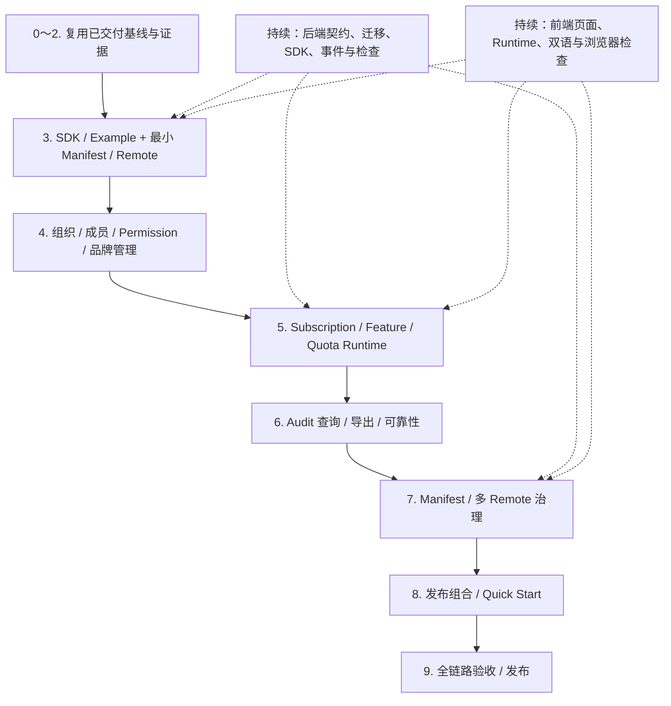

# MVP 开发计划清单

> **执行基线：2026-09-30。** 本文是 `saas-forge` 与独立 `saas-forge-web` 的跨仓 MVP 总计划，保留原阶段 0～9 的编号及产品范围，按统一 Console 更新交付责任、阶段状态和验收方式。两仓分别构建、验证和发布，通过正式契约与固定版本 Client 协作。具体实现由关联 Issue 承接，本文不代替契约或已生效 ADR。

## 目标、边界与当前起点

MVP 的产品闭环沿用 [产品范围](01-product-scope.md)：

```text
部署平台 → 平台管理员配置权益 → 创建租户和订阅 → 初始化租户管理员
→ 租户管理员管理组织、成员和角色 → Project SaaS 接入 SDK
→ Tenant Context、Permission、Feature、Quota 校验 → 执行业务 → 审计可查询
```

正式前端是独立仓库中的 Vue 3 + Element Plus + Soybean Admin 统一 Console。本文的“平台工作上下文”“租户工作上下文”是同一 Console 内的授权视图，不是两个独立应用或登录入口。认证使用 [ADR 0052](adr/0052-unified-console-authentication-uses-versioned-session-protocol.md) 的 v2 统一会话；是否启用必须按环境受控切换，不能由开发计划或默认启动自动授权。业务 API 继续遵守已发布 v1 契约，认证 v2 不表示全部资源 API 升级。

MVP 不包含完整支付/账单/发票、公共注册和外部身份源、多语言 SDK、Schema Per Tenant 或 Database Per Tenant 隔离、CLI，以及 Helm/systemd 的完整生产交付。后两项在架构与配置上保持兼容，不作为 MVP 发布阻塞项。Manifest、业务 Remote、审计导出及必要的安全、国际化、视觉和无障碍检查仍在范围内。

产品兼容范围为桌面版 Google Chrome 当前稳定版和 JDK 17，见 [ADR 0046](adr/0046-development-supports-chrome-and-jdk17.md)。Chromium 可用于日常功能和视觉测试；不扩大浏览器/JDK 支持矩阵。本文不估算工期，排期需要另行明确人员、可用工时与目标日期。

### 当前阶段状态

“已实现”表示有代码或配置；“已验收”表示相应范围有直接证据；“待验收”表示仍缺指定证据；“未实现”表示尚无该产品闭环。已有局部实现不能据此勾选整个阶段。下面的状态以本次本地代码/配置、既有验收记录及在线 Issue/CI 核对为依据，不表示本次重新运行产品验收。

| 阶段 | 当前基线 | 剩余交付或证据 |
| --- | --- | --- |
| 0. 关键决策 | 前置领域、安全与数据决策已记录 | 后续 Manifest 治理、导出授权等局部决策在相关阶段开始前冻结 |
| 1. 工程与运行基线 | 两仓独立交付、正式 Client、统一 Console 与检查入口已建立；迁移总票 [#201](https://github.com/crane199709/saas-forge/issues/201) 已关闭 | 完整布局、视觉、无障碍及旧独有断言按覆盖范围继续核对；迁移关闭不等于未来页面覆盖完成 |
| 2. 身份与租户最小闭环 | 已实现并按 [#183](https://github.com/crane199709/saas-forge/issues/183) / [#189](https://github.com/crane199709/saas-forge/issues/189) 验收；两票已关闭，交付提交 CI 通过 | 保持现有回归；后续改动重新验证受影响边界，不重复建设已交付页面 |
| 3. SDK 与 Example | BOM、基础 SDK 与 Starter 已实现；`examples/` 当前只有 README | Project/Task、最小 Manifest 与正式业务 Remote 闭环未实现 |
| 4. 组织、成员与 Permission | 已有 Membership、静态角色绑定、冻结/恢复与品牌档案基础 | Organization、通用 RBAC 目录、Invitation 激活、恢复流程、品牌素材管理及其产品闭环未实现 |
| 5. Subscription、Feature 与 Quota | 已有 Plan、Quota Definition、首个 Subscription 和管理员初始化的最小额度链路 | 完整订阅生命周期、Feature 与通用 Quota Runtime、租户权益视图及 Example 联调未完成 |
| 6. Audit 与事件可靠性 | 三类成功事实消费、只追加记录已有实现与证据 | 完整业务事件覆盖、公开查询、导出、SDK 与 Console 闭环未完成 |
| 7. Manifest 与 Remote 治理 | 静态 Remote 资源安全已有验证基础 | 产品 Manifest 生命周期、多 Remote 集成与治理未实现 |
| 8. 本地交付与发布强化 | 原生开发入口、独立服务 Compose 与两仓 CI 已有基础 | 包含 Example/Remote/对象存储的完整发布组合及 Quick Start 尚待后续阶段收敛 |
| 9. 全链路验收与发布 | 阶段验收可复用其明确范围内的证据 | 完整 MVP 发布验收未执行，不能由阶段 2 或仓库迁移结论替代 |

阶段 2 的真实运行见 [#189 同轮聚合记录](acceptance/issue-189-stage2-aggregation.md)：执行时两仓均为 dirty，时间到期采用受保护状态注入，服务消费是非生产平台机制验收，运行条件与已知限制按原记录保留。本次在线核对后端交付提交 `a405a91580293d9648f85e169df1905efa9d5fd9` 的 [Verify](https://github.com/crane199709/saas-forge/actions/runs/36655253715) 和前端交付提交 `7b243f21aeca412461c9e4b466973e9f2fab28c2` 的 [verification](https://github.com/crane199709/saas-forge-web/actions/runs/36655266896) 均为成功。这补充原记录写入时的“CI 尚未执行”，不改写原始运行事实，也不证明本次文档修改已通过远端 CI。

## 两仓责任与契约交接

| 交付面 | 后端 `saas-forge` | 前端 `saas-forge-web` | 联合完成条件 |
| --- | --- | --- | --- |
| 契约与 Client | OpenAPI v1/v2、Protobuf、事件、生成接口、Java SDK、正式 TypeScript Client 发布 | 固定版本依赖、锁文件、类型化调用与错误映射 | 契约、包版本及来源可追溯；前端不复制后端模型或读取后端源码 |
| 业务切片 | 权威领域规则、授权、迁移、事件与服务接口 | 真实页面、操作恢复、会话、品牌、双语与无障碍 | 页面操作与服务权威结果一致，拒绝/恢复有真实证据 |
| 环境 | 服务/依赖、迁移、发现、受信 HTTPS/Gateway、隔离准备与探针 | 构建或启动自身制品，连接已就绪环境 | 环境准备者明确配置、制品来源、清理责任，不接管日常进程 |
| 检查 | Maven/JDK 17、契约、迁移、RLS、服务、后端工具与专项环境检查 | 类型、Lint、Runtime/业务测试、国际化、构建、视觉/无障碍与 Chrome | 两仓 CI 分别通过；跨仓专项按同轮标识关联，任一失败均阻断该专项 |
| 发布 | 后端镜像、SDK/Client、迁移与配置版本 | Console/Remote 静态制品与依赖版本 | 独立发布，记录可工作的版本组合和升级/回退限制 |

每个业务切片按“契约评审 → 服务实现及兼容验证 → 正式 Client 发布 → 前端固定版本接入 → 同轮联调验收”交付。前端可提前准备布局与 Mock，但必须标为模拟结果；未发布契约或 Mock 不构成产品交付。当前两仓声明的正式包为 `@crane199709/saas-forge-api-client@0.4.0`；未来升级以各自清单、锁文件与包来源为准，不将该版本永久冻结。

浏览器业务调用只使用正式类型化 HTTP Client，不把 Cookie、Origin、Fetch Metadata 或 Bearer Token 暴露为业务参数。共享 Runtime 拥有会话及内存 Token，Remote 不自行读取、持久化或刷新凭据。破坏性协议变化、权限边界变化与部署切换仍需独立决策，不由普通 Client 升级隐式完成。

每个阶段以一个业务验收目标组织后端和前端关联 Issue，记录：范围/非目标、公开契约、阻塞关系、两仓任务、Client/制品版本、成功与拒绝/恢复标准、证据位置和清理责任。各仓 Issue 完成实现后，仍须满足阶段联合验收；避免以两仓分别“测试通过”替代真实产品闭环。

## MVP 完成定义

- 新环境按 Quick Start 可部署统一 Console、Gateway、领域服务、官方 Project SaaS Example、业务 Remote 和全部必需依赖；明确两仓制品获取与受控配置步骤。
- 平台工作上下文支持 Feature、Quota Definition、Plan、Tenant、Subscription 与租户管理员初始化。
- 租户工作上下文支持组织、成员邀请与激活、角色与 Permission；平台与租户授权互不越权。
- Example 仅经 Java SDK/Starter 获取可信 Tenant Context，同时执行 Permission、Feature 与 Quota 校验；应用层与 PostgreSQL RLS 共同隔离租户数据。
- 关键成功、拒绝与配额/业务操作产生可查询的审计事实，查询和导出受权威授权约束。
- 统一 Console 与业务 Remote 复用 Soybean/Element Plus 组件基础和统一交互、认证、HTTP、错误、品牌及国际化语义；当前语言标识为 `zh-CN` 与 `en`。
- 业务阶段完成对应真实页面及 Fresh Compose + Chrome 核心成功与重要拒绝/恢复路径；接口调用、Mock、生成 Client 或 curl E2E 只证明各自边界。
- 两仓完整检查和第 9 阶段发布门禁通过；后端 `./mvnw verify` 不代表前端或跨仓端到端验收通过。

## 实施顺序与依赖

阶段按业务闭环推进。已完成能力作为下一阶段的前置；契约、事件、可观测性、页面与测试随业务持续交付。


```mermaid
flowchart TD
    B["0～2. 复用已交付基线与证据"] --> D3["3. SDK / Example + 最小 Manifest / Remote"]
    D3 --> D4["4. 组织 / 成员 / Permission / 品牌管理"]
    D4 --> D5["5. Subscription / Feature / Quota Runtime"]
    D5 --> D6["6. Audit 查询 / 导出 / 可靠性"]
    D6 --> D7["7. Manifest / 多 Remote 治理"]
    D7 --> D8["8. 发布组合 / Quick Start"]
    D8 --> D9["9. 全链路验收 / 发布"]
    C["持续：后端契约、迁移、SDK、事件与检查"] -.-> D3
    C -.-> D5
    C -.-> D7
    F["持续：前端页面、Runtime、双语与浏览器检查"] -.-> D3
    F -.-> D5
    F -.-> D7
```

- 阶段 3 同时交付最小 Manifest 审核/启用和可用业务 Remote；完整版本、来源、升级/回退治理留给阶段 7。
- SDK 的 Permission、Feature、Quota、Audit 随阶段 4～6 分别完成。阶段 3 的基础 SDK 可用不表示这些运行时能力已交付。
- 阶段 4 复用已有冻结/恢复及品牌读取能力，新增组织权限、品牌素材管理和必要对象存储；阶段 6 在隔离的凭据、Bucket/前缀与生命周期边界内复用对象存储。
- 阶段 5 复用已有 Plan/Quota Definition/Subscription 最小链路，补齐权益运行时和完整生命周期；阶段 6 复用只追加消费基础，补齐公开查询与导出。
- 阶段 8 的配置、迁移、可观测与发布工作随前面切片持续推进，最后收敛；不把早期页面、TLS、CI 和服务发现推迟到该阶段。

### 当前执行队列与 Issue 衔接

1. 复用阶段 0～2 的已有能力和有效证据；阶段 1 的布局缺口由前端 #11 承接，相关视觉/无障碍及旧独有断言在对应页面与阶段验收前补齐，不推迟到发布时才处理。
2. 下一业务里程碑是阶段 3：先细化 Example/Manifest 的公开契约与两仓子任务，再依次交付真实 API、平台审核页面、租户 Remote 和跨租户拒绝验收。
3. 阶段 4～7 按依赖细化规格，不在同一任务中实现全部 MVP；发布工程持续跟随。

2026-09-30 在线核对：后端 [#88](https://github.com/crane199709/saas-forge/issues/88) 仍为阶段页面/浏览器交付总票，[#209](https://github.com/crane199709/saas-forge/issues/209) 是坐标与元数据迁移专项；#183、#189、#201 已关闭。#88 正文仍含旧双 Console、旧 UI 包与旧 Locale 描述，后续拆票需引用本计划及 ADR 0052 的现行边界。前端当前开放的 [#11](https://github.com/crane199709/saas-forge-web/issues/11) 承接响应式内容栅格与标准主辅栏布局，纳入阶段 1 的剩余覆盖。本文修改不创建、评论或关闭远端 Issue；后续阶段先复用已有任务，再补齐缺少的两仓子票，不虚构编号。

## 验证方式与证据规则

日常开发按[原生本地开发](native-local-development.md)准备依赖、证书、域名和 Git 忽略的个人配置；前端执行 `pnpm run dev`，后端用 IDE Run/Debug。跨服务联调仍使用 Nacos 服务发现，浏览器仍经受信 HTTPS 与 Gateway。完整 Compose 用于集成验收、演示和专项复现，不成为普通改动的默认本机门禁。

日常验证按影响面执行：后端选择相关模块 Maven/工具测试；前端使用 `pnpm run verify`，涉及 UI 时执行 `pnpm run verify:ui`，真实环境检查使用 `pnpm run verify:browser -- <handoff.json> <新产物目录>`。后者只是其声明范围内的冒烟；阶段业务、安全、故障、Remote 与发布矩阵必须使用相应专项，不得用冒烟通过代替。完整检查由各仓 CI 承担，保留本机复现能力。

跨仓专项遵循[独立验证与环境交接](acceptance/independent-verification.md)：记录同轮 runId、handoff SHA-256、两仓源码/dirty、运行制品、Client/锁文件来源、Chrome/JDK、隔离环境及清理责任。后端探针和前端 Chrome 分别输出结果；同轮关联通过只证明所执行场景，不自动扩大为阶段或 MVP 完成。业务资源经正式页面建立，部署引导和获授权故障注入按专项边界执行。

证据明确区分通过、失败、跳过、未执行，区分真实浏览器/后端、自动化/HTTP、Mock 和静态检查。长期记录放入 `docs/acceptance/`，不引用 `.scratch/` 或本机备份作为交付物；凭据与原始敏感产物不得进入报告。旧历史记录保持原事实，现行覆盖参考[测试归属](console-testing-baseline.md)、[迁出记录](acceptance/consoles-extraction.md)与 [#207 清理清单](acceptance/issue-207-cleanup.md)。

## 开发清单

`[x]` 保留已有条目及其证据范围，不表示本次重跑；`[ ]` 表示尚未完成该条目的完整要求，可能已有可复用基础。阶段 0～2 是已交付基线与剩余覆盖，阶段 3～9 是后续工作；业务阶段分别列出后端、前端与联合验收责任。

### 0. 关键决策冻结

- [x] 评审并记录 Tenant、Subscription、Plan、Feature、Quota、Invitation 的枚举、允许状态迁移、幂等与错误码；实现必须遵循[核心领域契约](17-core-domain-contracts.md)。
- [x] 将 MVP Quota 限定为 `max_users` 与 `max_projects`，决定计量单位、`check`/`consume`/`release` 的结果语义、失败补偿规则和并发扣减策略；其他计量类型不阻塞核心闭环。
- [x] 决定首个 Platform Admin 的安全初始化方式、开发与生产的 JWT 私钥/KMS 接入方式，以及初始凭据轮换流程；见 [ADR 0007](adr/0007-system-creates-the-default-platform-admin.md)、[ADR 0008](adr/0008-production-jwt-signing-uses-kms.md) 与[安全设计](12-security-design.md)。
- [x] 确认 统一 Console 的平台/租户工作上下文与 Shell、业务 Remote 的最终域名拓扑，从而确定 Cookie `SameSite`、CSRF 方案和 CORS 白名单；见 [ADR 0009](adr/0009-browser-surfaces-use-controlled-origins.md)、[API 设计](08-api-design.md)与[安全设计](12-security-design.md)。
- [x] 明确“Tenant 创建与管理员初始化”“邀请激活”“Tenant 切换”“成员禁用/Tenant 冻结”四条跨服务流程的数据所有权、同步调用、事件、失败恢复与幂等责任；见[跨服务工作流契约](18-tenant-access-cross-service-workflows.md)、[ADR 0010](adr/0010-tenant-access-cross-service-workflows.md)与[事件契约](../saas-forge-contracts/saas-forge-event-contracts/tenant-access-workflows.md)。
- [x] 确认数据库、Redis 与应用日志规范以版本化文档和 CI 校验维护，不得以跨服务共享领域实体或数据库模型的方式实现；见[数据库设计与规范](11-database-design.md)、[Redis Key Registry](19-redis-key-registry.md)、[应用日志规范](20-application-logging.md)与[ADR 0011](adr/0011-versioned-data-cache-and-logging-standards.md)。静态门禁已接入 Maven `verify`；真实 Flyway/RLS、Redis 故障和日志输出的运行时门禁随首个相关实现同步加入。
- [x] 为影响服务边界、安全模型和公开契约的决策建立 ADR；跨服务流程见[ADR 0010](adr/0010-tenant-access-cross-service-workflows.md)，导出留存期、Manifest 审批细节等局部决策在对应阶段开始前冻结，不阻塞第 1～5 阶段。
- [x] 决定 Tenant Access 拥有受控 Tenant Brand Profile：未建立权威 Tenant Context 时完整使用 Platform Brand Profile；建立后只有当显示名称、Logo、favicon、主色与强调色整份有效时才能原子应用，否则整份回退平台品牌；Tenant 品牌不得改变统一布局、组件、状态颜色、交互语义或无障碍约束，见 [ADR 0036](adr/0036-tenant-access-owns-controlled-tenant-brand-profiles.md) 与 [ADR 0042](adr/0042-browser-surfaces-atomically-apply-one-resolved-brand.md)。

**完成标准：** 第 1～5 阶段依赖的关键决策均可追溯，不存在会改变服务边界、安全模型或公开契约的未决规则。

### 1. 工程与运行基线

**领域、契约与运行基线**

- [x] 固化 Maven Wrapper 与 JDK 17 构建（历史 JDK 21 兼容门禁现按 [ADR 0046](adr/0046-development-supports-chrome-and-jdk17.md) 退出当前支持范围）；补齐依赖版本管理、测试、覆盖率和制品发布的父 POM 约定。详见 [Maven 构建与制品发布](21-maven-build-and-release.md)与 [ADR 0012](adr/0012-maven-coordinates-use-github-namespace.md)。
- [x] **先冻结 API 通用规范，再定义任何资源接口。** [API 设计](08-api-design.md#rest-约定)已明确路径、字段和枚举命名；UUIDv7、时间、日期、金额/小数与空值的 JSON 表示；参数边界与 `POST`、`PUT`、`PATCH` 语义；过滤、排序和游标分页；文件/异步任务；版本、幂等、关联 ID 和内容协商规则。
- [x] 明确成功与失败的统一返回模型，并提供 OpenAPI 可复用 Schema 和正反例。[API 设计](08-api-design.md#成功与失败响应)已冻结直接成功表示、`201`／`202` 的 `Location`、`204` 无响应体、集合与 Job 不变式，以及 Problem Details 与字段校验语义；[OpenAPI 公共组件](../saas-forge-contracts/saas-forge-openapi-contracts/common.yaml)提供机器可读 Schema、Response、Header 和示例。
- [x] 在[租户架构](05-tenant-architecture.md#tenant-context)、[API 设计](08-api-design.md#v1-资源边界)、[SDK 设计](09-sdk-design.md#身份与上下文)和[安全设计](12-security-design.md#授权租户与数据隔离)中重申租户安全边界：用户请求不得通过请求头、查询参数、请求体或语义等价别名传入/覆盖 Tenant；此类输入以 `400` 拒绝。服务身份只用 `client_id` 与显式 `scope` 授权，不建立或伪造用户上下文；缺少所需 scope 以 `403` 拒绝。
- [x] 在 `saas-forge-contracts/saas-forge-openapi-contracts/v1.yaml` 定义实施阶段 2、3 所需的 `auth`、Tenant 管理、JWKS 以及管理员初始化所需的最小权益前置链路；第 3 阶段不需要独立 Runtime 端点。Permission、Feature、Quota Runtime 操作和后续资源契约在对应阶段开始前评审，并以兼容方式加入同一 v1 契约；决策见 [ADR 0013](adr/0013-v1-openapi-contracts-follow-delivery-prerequisites.md)。
- [x] 在 `saas-forge-contracts/saas-forge-protobuf-contracts` 定义 IAM↔Tenant Access 所需的 Membership 即时校验接口；在 `saas-forge-contracts/saas-forge-event-contracts` 定义统一 CloudEvents JSON 信封、审计事件和缓存失效事件的版本规则。
- [x] 建立 spec-first 生成链路：后端维护 OpenAPI v1/v2、服务端生成接口与 Java Client；默认 TypeScript 输出在 OpenAPI 模块的 `target/generated-typescript-client`，正式 npm Client 在 `saas-forge-contracts/saas-forge-openapi-contracts/typescript-client/` 独立构建/发布。前端消费固定版本包并自行类型检查；后端 Maven 不读取前端仓库。operation 归属、生成接口与禁止反向修改契约的规则见 [ADR 0015](adr/0015-openapi-is-the-source-of-generated-rest-code.md)。
- [x] 增加 REST、Protobuf 与事件的兼容性检查，阻止破坏性 v1 变更。
- [x] **先发布数据库建模与迁移规范，再创建业务表。** [数据库设计与规范](11-database-design.md)已覆盖表/列/索引/约束的命名，类型、可空性、默认值和时区，UUIDv7 主键，外键的服务内边界，状态/软删除/历史记录的适用规则，以及 Flyway 不可变版本、前向修复和数据回填约定。
- [x] 明确公共持久化字段的适用矩阵：独立实体默认使用 `id`，Tenant 范围表必须使用非空 `tenant_id`，`created_at`、`updated_at`、`deleted_at` 与 `status` 按数据语义使用；全局表和平台表不得为了“统一”而伪造 `tenant_id`。`created_by`、`updated_by` 等操作者字段由具体审计/查询需求逐表评审。
- [x] 保持服务领域模型私有：不创建跨服务的 `BaseEntity`、共享 MyBatis Entity 或共享数据库表。SDK 不发布持久化基类；用户仅可在自己拥有的单个服务和数据库边界内选择本地基类。跨服务共享物限于版本化契约、构建 BOM、安全和可观测性基础设施契约，并在服务边界映射为内部模型。
- [x] 为 IAM、Tenant Access、Entitlement、Audit 分别配置独立数据库账号组、Flyway 迁移链和 PostgreSQL 18 原生 `uuidv7()` 主键生成；由独立集群引导工件创建数据库、账号与 `public` Schema 最小权限，每库以 `*_migrator` 执行迁移、以非所有者且无 `BYPASSRLS` 的 `*_app` 运行服务；迁移任务成功后才启动应用，应用不自动迁移且不持有迁移账号；禁止跨服务/跨数据库表引用、外键、`JOIN`、FDW 与 `dblink`，但允许同服务同库关系；见 [ADR 0017](adr/0017-separate-flyway-and-runtime-database-accounts.md)、[ADR 0018](adr/0018-postgresql-18-native-uuidv7-primary-keys.md)、[ADR 0019](adr/0019-cluster-bootstrap-precedes-service-flyway.md)、[ADR 0020](adr/0020-flyway-runs-as-a-predeployment-job.md) 与 [ADR 0021](adr/0021-runtime-accounts-cannot-create-database-objects.md)。
- [x] 建立服务内 Transactional Outbox、可靠发布器和按事件 ID 幂等消费的统一工程约定；各服务在对应业务切片中落地自己的表和实现，事件携带并传递 `traceId`。
- [x] 建立 Tenant 范围表的 RLS 测试夹具：非空 `tenant_id`、事务级 `app.tenant_id` 设置、默认拒绝策略，常规运行账号不拥有 `BYPASSRLS`；仅 `*_migrator` 可通过角色限定维护策略执行跨 Tenant 数据回填，`*_app` 不得继承或切换至该角色；见 [ADR 0022](adr/0022-migration-roles-are-the-only-rls-maintenance-exception.md)。
- [x] **先发布 Redis Key Registry，再接入 Redis。** 为每个 Key 定义固定前缀/环境/服务/用途/版本/标识符格式、值序列化、TTL、最大基数、失效事件、单一写入所有者、读取者和故障策略；首版已覆盖 JWT `jti` 黑名单（TTL 为 Token 剩余有效期）、撤销 Signing Key `kid`、Refresh Token/会话缓存、登录保护和 Gateway 限流。Key 中禁止存放 Token、密码、Secret、邮箱等原始敏感值；Redis 不得作为 Quota 额度真相。SDK 的 Permission/Feature 默认使用进程内短缓存，业务可替换为自己的 Redis，未命中时经平台接口权威回源，不属于平台 Redis Registry。
- [x] **先发布结构化日志规范，再写业务日志。** [应用日志规范](20-application-logging.md)、[日志 Schema](../saas-forge-contracts/logging/application-log.schema.json)与[日志策略](../saas-forge-contracts/logging/policy.json)已定义基础必填和场景条件必填字段、关联字段、HTTP/异常字段、字段白名单与脱敏、级别、采样和保留类别。容器使用结构化标准输出由 Collector 收集；虚拟机以 `systemd`/日志转发收集，应用不依赖本地滚动日志文件。日志不能替代只追加的 Audit Record。
- [x] 建立包含 Gateway、四个服务、PostgreSQL、Redis、Kafka 和 OpenTelemetry Collector 的最小 Docker Compose；S3 兼容存储随第 4 阶段的受控 Tenant 品牌素材加入，第 6 阶段在分离的存储边界内复用其基础能力承载 Audit 导出。
- [x] 使用 Testcontainers 建立 PostgreSQL 18、Redis 和 Kafka 集成测试基础设施，并建立首版 GitHub Actions 构建、单元测试、契约兼容性和迁移检查；数据库门禁必须验证四库八账号、独立迁移链、运行时最小权限/RLS、数据库 UUIDv7 默认值，以及审计记录不可由 `audit_app` 修改或删除。
- [x] Gateway 提供最小路由、Problem Details 错误规范化和 W3C Trace Context 透传；鉴权、限流和来源策略在后续闭环中逐步增强。实现边界见 [ADR 0025](adr/0025-gateway-uses-spring-cloud-gateway-server-mvc.md)。

**前端：统一 Console 与浏览器基线**

- [x] 在独立 `saas-forge-web` 建立基于 Soybean Admin Element Plus 的统一应用、平台/租户工作上下文与共享 Runtime，消费正式发布的固定版本 Client；迁移依据见 [ADR 0052](adr/0052-unified-console-authentication-uses-versioned-session-protocol.md) 和 [#201](https://github.com/crane199709/saas-forge/issues/201)。
- [x] 建立统一认证、权威工作上下文选择/切换、刷新、退出和失权处理；一个当前 Identity/工作上下文及 v2 会话边界不随视图切换退回旧双登录协议。
- [x] 复用 Vue 3、Element Plus、Soybean 布局与组件，建立双语、主题、类型化 HTTP、错误展示、品牌及键盘/焦点基础；现有检查范围见[测试归属](console-testing-baseline.md)。不以已迁出的 UI 包作为新页面依赖。
- [x] 建立 `zh-CN` / `en` 资源检查与非敏感本地偏好；统一 Origin 内的平台/租户工作上下文共享偏好。Remote 的 Locale/品牌消费随正式业务 Remote 实现后验收。
- [x] 保留四域受信 HTTPS、精确 Origin、Cookie、CSRF、CORS 与无凭据 Remote 静态资源检查；统一 Console 的应用入口与旧平台域处理遵循受控部署策略，保留域名不表示恢复两个产品应用。历史拓扑证据见 [#159](acceptance/issue-159-four-domain-matrix.md)，当前入口见[独立验证](acceptance/independent-verification.md)。
- Remote 静态资源保持无凭据、精确 CORS、同版本内容不可变及缺失资源真实 `404`；API 的 CSRF 必须由服务端拒绝，不能以浏览器读不到响应代替。静态夹具不进入产品导航，也不证明 Manifest 审核/启用或业务 Remote 已实现。
- [x] 两仓分别拥有构建与测试入口；前端生产 UI/自动无障碍/视觉回归已接入自身 CI，后端 CI 不读取前端源码或运行浏览器。
- [ ] 完成最终页面的响应式布局、标准分栏、窄屏重排、键盘/焦点、语义化控件与完整无障碍矩阵。现有桌面浅深快照及场景扫描只证明所覆盖页面，不证明完整矩阵，也不引入移动浏览器支持承诺。
- [ ] 对照迁出清单逐项核对仍有效的 Session Tabs、错误边界、品牌、国际化与视觉独有断言；已有专项证据按实际覆盖复用，其余纳入对应业务阶段，保留失败传播。

**完成标准：** 后端工程、安全与数据基线可独立构建验证；统一 Console 可在受控 HTTPS 拓扑运行，前端检查独立执行；已有能力和未来页面覆盖分别记录。当前基础交付可供阶段 3 使用，完整布局与覆盖要求仍须在对应页面交付和最终发布前完成。

### 2. 身份与租户最小闭环

本阶段已交付统一 Console 的身份、最小权益、租户初始化、生命周期和 OAuth 管理闭环；状态与两仓 CI 依据见本文“当前阶段状态”。历史规格中的双 Console/Intent 表述按 ADR 0052 更新为统一工作上下文，已发布业务 API 的语义与安全责任保留。

**后端：领域与服务**

- [x] 实现 Identity、Credential、Refresh Token、OAuth Client/Secret、Signing Key Metadata 的迁移、领域规则与仓储；密码使用 Argon2id，Refresh Token 和 Client Secret 仅保存哈希。
- [x] 实现邮箱密码登录、约 15 分钟的 JWT Access Token、HttpOnly Refresh Token Cookie、登出、刷新轮换和 JWKS 发布；Token 仅携带 `identityId`、`membershipId`、`tenantId`、`jti`。
- [x] 实现 Tenant 最小生命周期、Membership 和平台侧 Tenant 创建；创建 `PENDING` 与管理员初始化后的 `PENDING → ACTIVE` 已交付；Tenant Suspension/恢复与下述会话撤销、`jti` 黑名单链路共同交付，不允许无安全副作用的状态切换。按已冻结的跨服务流程安全初始化 Platform Admin 与 Tenant Admin。该切片同步实现 OpenAPI 已冻结的 `max_users` Quota Definition 创建/激活、单额度 Plan 创建/激活与首个 ACTIVE Subscription 五个最小 Entitlement Bootstrap 接口，并前移流程所需的最小 Client Credentials 签发、服务 Token 校验、精确内部 Scope 与按 [ADR 0030](adr/0030-deployment-bootstraps-reserved-service-oauth-clients.md) 创建的 Compose/Testcontainers 服务身份，禁止以测试种子或未认证内部调用替代真实闭环；IAM、Tenant Access 与 Entitlement 分别以服务内 Transactional Outbox 发布本切片已冻结的提交事实，完整 Client 管理与权益生命周期仍由后续条目交付。
- [x] IAM 通过同步契约调用 Tenant Access 验证当前与目标 Membership，实现当前 Refresh Token Family 的 Tenant Context Switch，并将该 Family 切换前签发且未过期的全部 User Access Token 写入持久撤销事实和 Redis Revocation Index；本项只验收 IAM 撤销权威与索引，Gateway 实际拒绝及 Redis fail-closed 由下一安全条目验收。
- [x] 复用已完成的普通登出撤销模型，实现成员禁用所需的按 Membership 批量会话与 `jti` 撤销能力，并完成 Tenant Suspension 的按 Tenant 批量撤销与状态迁移；IAM 在批量撤销前建立 Revocation Fence，阻止目标范围并发签发或使用未被扫描的新 Token。Gateway 同步完成最小用户 Token 验签、`jti`/`kid` 与 Revocation Fence 检查、Revocation Index Ready 检查，Redis 不可用或索引未就绪时必须 fail-closed。Invitation 激活、Password Recovery 和成员禁用公开工作流在第 4 阶段随成员闭环完成。
- [x] 在已前移的最小签发与校验链路上，按 [Client Credentials 管理规格](22-oauth-client-credentials-management.md)补全仅服务间使用的 OAuth 2.0 Client Credentials 管理：Secret 一次展示、重叠轮换和吊销；服务 Token 不建立用户 Tenant Context。
- [x] 完成 Gateway 用户/服务 Token 路由策略与三类成功事实审计总项；只有以下两个可独立验收的子项均有直接证据后才勾选：
  - [x] [Issue #75](https://github.com/crane199709/saas-forge/issues/75)：按 [Gateway 通用路由目录与 User/Service Token Scope 策略](23-gateway-service-scope-routing.md)建立受控 Service/Scope Registry、共享不可变 Route Catalog、Gateway与 Starter双重校验，以及真实 IAM/Redis/Nacos和非生产接收端验收。首个生产 Runtime operation仍由后续对应领域 Issue交付。
  - [x] [Issue #76](https://github.com/crane199709/saas-forge/issues/76)：按 [三类成功事实的 Audit Record 消费闭环](24-audit-success-fact-consumption.md)将 Session Started、Tenant Created、Tenant Context Switched映射为只追加 Audit Record，完成真实 Kafka/PostgreSQL去重、重试、隔离、重放和最小权限验收。

**前端：统一 Console 产品路径**

- [x] 登录、首次改密、权威上下文候选、平台/租户工作上下文选择与切换、刷新恢复及退出；失权时停止展示受保护内容。
- [x] 平台工作上下文中的 Quota Definition/Plan、Tenant、Subscription、租户管理员初始化及通知读取/重发；新管理员经真实邮件进入正式 Password Setup 页面。
- [x] Tenant Suspension、显式恢复与不确定结果继续处理；恢复不复活旧会话，新登录后重新取得权威上下文。
- [x] OAuth Client 创建、Secret 一次展示、丢失结果恢复、重叠轮换和吊销；Secret 不进入持久存储、日志或重复读取接口。

**联合浏览器验收**

- [x] 同一次 Fresh Compose + Chrome 完成平台管理员初始化/登录、最小权益、Tenant/Subscription、管理员初始化、真实邮件 Password Setup、租户登录/选择/切换及刷新；本轮三类成功事实与 Audit 记录精确关联。
- [x] 真实页面与独立探针验证错误 Token、Refresh 重放、撤销、Redis fail-closed 与恢复、越权、冻结/解冻后旧会话拒绝；未知错误阻断验收。
- [x] 同轮验证 OAuth 一次展示、丢响应恢复、原操作者/时限/一次性边界、重叠窗口与吊销；经 Gateway/Nacos/Receiver/Starter 验证实际 Scope 与凭据生效，不扩展为生产业务 Runtime。
- [x] 默认中文完整主链，页面切换英文并执行代表性身份/Tenant 路径；统一 Origin 偏好持久化，切换不丢失输入或触发额外业务写入。

**完成标准：** 上述产品路径、权威结果和重要拒绝/恢复在同轮真实环境中成立，且交付提交的两仓 CI 通过。该范围已完成，见 [#189 原始记录](acceptance/issue-189-stage2-aggregation.md)、[#183 关闭状态](https://github.com/crane199709/saas-forge/issues/183)及本文精确 SHA 的 CI 链接；不代表后续阶段或完整 MVP 完成。保留到期状态注入、实际超时配置、dirty 来源及未复现问题的原始限制。

### 3. SDK 与 Example 租户隔离闭环

**后端：领域与服务**

- [x] 完成 BOM、`sdk-core`、`sdk-auth`、`sdk-tenant` 与 Starter 的首个可用版本；从公开契约生成 REST Client，不暴露内部 gRPC 或数据库模型。
- [x] Starter 集成 Spring Security Resource Server 和 IAM JWKS，固定只接受 `RS256`，支持按 `kid` 缓存公钥、未知 `kid` 受控刷新、常规密钥轮换、撤销 `kid` 与 `jti` 的 Redis fail-closed 检查，以及不可写的 Identity/Membership/Tenant Context。
- [ ] 实现 Project/Task Example 的最小业务 API；仅经 Starter 获取 Tenant Context，并在租户范围表使用事务级 `app.tenant_id` 和 RLS。
- [ ] 为 Example 接入 Gateway 路由、结构化日志、Trace 和最小审计投递；API 集成测试和种子数据只作为诊断与准备手段，不能替代本阶段最终 Tenant Shell/Remote 浏览器验收。
- [ ] 冻结首版 Manifest 最小契约：`module`、`version`、受控 `source`、生命周期状态与审核/启用事实；只允许 CI Client Credentials 注册，只有 Platform Administrator 审核并启用的受控来源可被 Shell 加载。

**前端：Console 交互**

- [ ] Console 平台工作上下文提供 Manifest 注册结果、审核、启用和拒绝界面，不允许仅因服务注册或来源可访问而自动公开 Remote。
- [ ] Console 租户工作上下文与 Shell 从首版开始采用最终 Remote 架构，只加载已启用 Manifest 的受控来源；Shell 独占认证状态与共享 HTTP Client，Project/Task Remote 不读取、存储或自行刷新 Token。
- [ ] 将 Project/Task 页面实现为最终业务 Remote，使用共享组件与交互规范、Locale、导航和错误语义，通过 Gateway 调用真实 Example API。

**联合浏览器验收**

- [ ] 从全新 Compose 数据卷用 Playwright 完成“CI 注册 Manifest → Platform Administrator 审核并启用 → Tenant Shell 加载 Remote → 创建/读取 Project 与 Task”的完整路径。
- [ ] 通过真实 Shell、Remote、Gateway、Starter、Example 与 PostgreSQL RLS 验证 Tenant A 可操作自己的 Project/Task、不能读写 Tenant B 数据，缺失 Tenant Context 默认拒绝。
- [ ] 验证未审核、未启用、来源不受控和加载失败的 Remote 不会进入业务页面，Shell 显示统一且可恢复的错误边界；验证 Locale 传递和另一语言代表页面。

**完成标准：** Tenant A 经最终 Tenant Shell 与 Project/Task Remote 可创建和读取自己的数据，但无法读、写、改、删 Tenant B 数据；缺失 Tenant Context 默认拒绝；Manifest 审核/启用与 Remote 拒绝路径有真实浏览器证据；独立 Spring Boot 业务服务只引入 Starter 和受控配置即可获得可信上下文。

### 4. 组织、成员与 Permission 闭环

**后端：领域与服务**

- [ ] 补全 Tenant 生命周期和平台侧管理：复用第 2 阶段已完成且受平台权限保护的 Tenant Suspension/恢复安全闭环，新增修改、启用、停用/到期，并为这些生命周期操作补齐审计事件。
- [ ] 实现 Membership、Organization/OrganizationUnit、邀请、Role、Permission、Role-Permission、Membership-Role 的模型、RLS 访问与 v1 API。
- [ ] 完成 Invitation 激活时仅面向从无凭据 Identity 的首次 Password Setup、已有 Password Credential 的 Password Recovery，以及成员禁用公开工作流；成员禁用复用第 2 阶段的按 Membership 批量会话与 `jti` 撤销能力。
- [ ] 实现平台角色与租户角色的独立授权边界，以及 SDK/Gateway 所需的 Membership、Permission 查询接口。
- [ ] 完成 `sdk-permission`，提供 `@RequirePermission` 和编程式检查；使用本地短缓存、Kafka 失效事件和经 Gateway 读取权威结果的回源路径。
- [ ] 在 Example 注册 `project:create`、`project:list`、`project:export` 等 Permission，覆盖允许与拒绝路径；成员、角色、权限和邀请变更写入 Outbox 与审计事件。
- [ ] 扩展 Manifest 的 Permission 声明和菜单授权元数据；声明只描述受控能力，服务端 Permission 权威校验不依赖客户端菜单可见性。
- [ ] 由 Tenant Access 提供 Tenant Brand Profile 最小契约和平台生成的受控同站素材引用，不接受任意外部 HTTPS URL；保持已发布 v1 的 Logo/favicon 可选字段兼容，新写入只产生五字段完整 Profile，缺失或无效的旧 Profile 由运行时整份回退平台品牌。具有明确品牌管理 Permission 的 Tenant Administrator 可配置，Platform Administrator 只能按平台安全政策禁用违规素材，不能代替 Tenant 修改。
- [ ] 在 Compose 中前移最小 S3 兼容对象存储，品牌素材与第 6 阶段 Audit 导出使用分离的存储边界、凭据、授权与生命周期策略；Logo、favicon 上传必须校验允许的类型、大小和安全策略。

**前端：Console 交互**

- [ ] Console 平台工作上下文提供 Tenant 修改、启用、停用/到期和 Platform Role 页面；Tenant Suspension/恢复直接复用第 2 阶段页面与安全语义，不重复建设另一套操作逻辑。
- [ ] Console 租户工作上下文提供 Organization/OrganizationUnit、Membership、Invitation、Role、Permission、Role-Permission 和 Membership-Role 页面，统一使用共享列表、表单、危险操作确认与错误反馈。
- [ ] Console 租户工作上下文完成 Invitation 激活、首次 Password Setup、已有凭据 Identity 的 Password Recovery、登录、成员禁用和授权允许/拒绝的连续产品路径。
- [ ] Tenant 设置页管理显示名称、Logo、favicon、主色与强调色 Token；未保存预览只能在隔离容器内复用同一解析器与品牌组件，不能改变当前 Shell、favicon 或标签页标题。保存成功后以 revision/ETag 和权威返回或权威回读更新真实 Shell，不通过时间戳猜测新旧；禁止自定义 CSS、布局、组件、状态/危险颜色和交互语义。

**联合浏览器验收**

- [ ] 从全新 Compose 数据卷用 Playwright 完成平台 Tenant 生命周期/Platform Role，以及租户 Organization、邀请、Membership、Role 与 Permission 管理路径。
- [ ] 验证新 Identity Password Setup、已有 Identity Password Recovery、成员禁用后的会话撤销、菜单隐藏与服务端授权拒绝；客户端菜单结果不得替代 Gateway/服务端 Permission 检查。
- [ ] 验证品牌素材上传、违规素材禁用、刷新恢复、Platform/Tenant 品牌边界和 Tenant Context 切换时无跨 Tenant 品牌泄漏，并覆盖中英文代表页面。浏览器证据必须包含无 Context 的完整平台品牌、合法 Profile 五项共同生效、任一字段或素材加载失败时五项共同回退、切换中间态立即回到平台品牌、新 Context 后一次切换、Logo 真实可见、迟到读取不得覆盖新品牌，以及 Remote 只继承 Brand Token Set 且不加载任意外部素材 URL。

**完成标准：** Tenant Administrator 经真实 Console 租户工作上下文可邀请并激活成员、创建组织和角色、分配 Permission 与受控品牌；同一 Identity 在不同 Tenant 可拥有不同 Membership、角色和品牌上下文；Example 的权限允许/拒绝、成员禁用、凭据恢复和品牌隔离均由全新 Compose 浏览器路径覆盖。

### 5. Subscription、Feature 与 Quota 闭环

**后端：领域与服务**

- [ ] 复用已交付 Quota Definition、Plan、首个 Subscription 与初始化额度基础，补齐 Feature、Plan-Feature、Plan-Quota、完整 Subscription 和不可变 Entitlement Snapshot 的领域规则、平台 API 与必要前向迁移，不重建已发布表或修改已执行迁移。
- [ ] 实现 Tenant 当前 Subscription 的单一生效约束、试用/到期/暂停等已冻结生命周期规则，以及套餐变更产生新订阅版本和权益快照。
- [ ] 实现 Runtime Permission/Feature 查询所需的权益接口；业务 Feature 不存在、禁用、未订阅、订阅到期均应稳定拒绝。
- [ ] 实现 `max_users` 与 `max_projects` 的 `check`、`consume`、`release`、`usage`：以数据库为额度真相，使用条件更新或行锁确保不超额，`operationId` 唯一保证重试幂等。
- [ ] 完成 `sdk-feature` 与 `sdk-quota`：提供 `@RequireFeature`、编程式 Feature 检查、同步 Quota API、Problem Details 异常映射及受控的超时、退避、重试和熔断。
- [ ] 为 Free 与 Professional 套餐配置 `project.basic`、`project.export`、`project.analytics`，以及 `max_users`、`max_projects`；在 Example 覆盖允许、未订阅、到期、超额和重复 `operationId` 路径。
- [ ] 发布权益变更与配额变更事件，供 SDK 缓存失效和 Audit 消费。
- [ ] 扩展 Manifest 的 Feature/Quota 声明和权益可见性元数据；客户端展示不替代服务端 Subscription、Feature 与 Quota 权威判定。

**前端：Console 交互**

- [ ] 复用平台工作上下文已有 Quota Definition、Plan、Subscription 页面，补齐 Feature、Plan-Feature、Plan-Quota、完整订阅生命周期与权益快照界面，保持统一列表、表单、状态与版本展示语义。
- [ ] Console 租户工作上下文提供当前 Plan、Subscription、Feature 和 Quota 使用量/限制的只读视图，并能解释未订阅、到期、暂停和超额等稳定拒绝结果。
- [ ] Example Remote 使用共享组件与交互规范展示 Permission、Feature、Quota 的允许、拒绝、到期、未订阅、超额和重复 `operationId` 结果，不暴露内部计量或缓存机制。

**联合浏览器验收**

- [ ] 从全新 Compose 数据卷用 Playwright 完成“Platform 配置 Feature/Quota/Plan/Subscription → Tenant 查看当前权益 → Example Remote 执行业务”的产品路径。
- [ ] 验证 Permission 与 Feature 组合拒绝、Subscription 到期/暂停/未订阅、Quota 超额、并发不超额和重复 `operationId` 不重复计量；浏览器结果与数据库权威状态一致。
- [ ] 验证权益变化后的菜单/页面可见性与服务端判定最终收敛，并覆盖 Locale 切换和另一语言代表路径。

**完成标准：** 一个 Tenant 任意时刻不会拥有两个当前生效订阅；统一 Console 的平台/租户工作上下文与 Example Remote 真实展示并执行 Permission、Feature 与 Quota 闭环；并发扣减不超额，重复 `operationId` 不重复计量，重要拒绝和恢复均有全新 Compose 浏览器证据。

### 6. Audit 与事件可靠性闭环

**后端：领域与服务**

- [ ] 定义最小审计事件白名单，记录 Tenant、Identity、Membership、Action、Resource、Request ID、IP、User Agent、时间、结果与经审查 Metadata；拒绝密码、Token、Client Secret 和原始敏感个人信息。
- [ ] 复用已有只追加 `audit_records`、事件 ID 幂等消费、重试/隔离基础，补齐本阶段完整事件覆盖与死信/告警策略；`audit_app` 对审计记录只具备 `SELECT`、`INSERT`，`export_jobs` 的可变权限单独授予；见 [ADR 0023](adr/0023-audit-records-use-append-only-runtime-privileges.md)。
- [ ] 验证 IAM、Tenant Access、Entitlement、Gateway 和 Example 的业务事务均通过各自 Outbox 可靠投递事件，并能以 `traceId` 关联同步调用和 Kafka 链路。
- [ ] 完成 `sdk-audit` 的异步审计 API、失败处理和使用文档，不让审计投递无界阻塞业务请求。
- [ ] 在开始导出功能前，冻结授权范围、对象存储签名 URL 留存期和清理责任；复用第 4 阶段已接入的 S3 兼容基础设施，但为 Audit 导出使用独立 Bucket/前缀、凭据、访问策略和生命周期，不与 Tenant 品牌素材共享授权边界。
- [ ] 实现经过授权的审计查询、游标分页和异步导出任务；导出结果存储为短期签名 URL，数据库只保存任务元数据。

**前端：Console 交互**

- [ ] 在统一 Console 适用的平台/租户授权范围提供 Audit 查询、筛选、游标分页和详情页面；Platform/Tenant 授权必须由服务端显式裁决，不能依赖前端隐藏条件。
- [ ] 提供 Audit 导出创建、进度/状态轮询、完成下载、过期、失败和重试/恢复界面；下载只使用短期签名 URL，Console 不持久化导出凭据。

**联合浏览器验收**

- [ ] 从全新 Compose 数据卷用 Playwright 产生身份、Tenant、Permission、Entitlement 和 Example 成功/拒绝事实，再通过真实 Console 查询、分页并核对 Audit Record。
- [ ] 验证重复事件不产生重复记录、失败事件进入受监控重试/隔离路径、导出异步完成并可下载、失败可恢复、过期 URL 被拒绝且文件按策略清理。
- [ ] 验证 Platform/Tenant 查询范围、敏感字段缺失和中英文代表页面；浏览器路径同时关联可观测 `traceId`，不得把日志作为 Audit Record 替代。

**完成标准：** 关键闭环操作均能经真实 Console 查询到不可修改的 Audit Record；事件重复消费不产生重复记录；失败事件可重试并进入受监控的隔离/死信路径；导出不阻塞请求且结果文件按配置自动清理，查询、导出、下载和失败恢复均有全新 Compose 浏览器证据。

### 7. Console 整合集成、Manifest 与 Remote 治理

**责任：** 后端负责 Manifest 权威状态、审批/来源/版本策略与审计；前端负责管理页面、Shell 加载与故障恢复；两仓共同验证升级、禁用、回退及隔离。

> **本阶段产品治理闭环未实现。** 当前静态 Remote 夹具与资源/CORS 证据不代表业务 Remote 或 Manifest 生命周期已交付。本阶段承接第 3～5 阶段逐步实现的最小加载、Permission、Feature/Quota 声明，完善跨模块治理。多语言、品牌与会话语义以现行[测试归属](console-testing-baseline.md)、[统一认证协议](unified-authentication-protocol.md)及 [ADR 0042](adr/0042-browser-surfaces-atomically-apply-one-resolved-brand.md) 为边界。

**两仓治理与集成**

- [ ] 冻结并实现完整 Manifest 生命周期、升级/回退规则、版本兼容、来源变更、启用/禁用、审批责任与历史审计；汇总第 3～5 阶段逐步加入的模块、Permission、Feature 和 Quota 声明。
- [ ] 完成 Console 平台工作上下文对 Manifest 版本、来源、审批、启停和故障状态的统一治理；不重复实现第 1～6 阶段已有业务页面。
- [ ] 完成 Console 租户工作上下文与 Shell 的跨模块导航、菜单授权、Locale、Tenant Brand Profile、Session 和共享 HTTP Client 集成，确保多个 Remote 不能覆盖全局契约或彼此污染状态。
- [ ] 完成 Remote 加载超时、资源失败、版本不兼容、运行异常、禁用中和来源失效的故障隔离与恢复；单个 Remote 故障不得破坏 Shell 导航、登出或其他模块。
- [ ] 对 Gateway 的受控 Origin、Cookie、CSRF、CORS 和 Remote 静态资源策略执行跨模块强化回归；不得在本阶段首次补建早期阶段所需的 TLS/Origin 基线。

**联合浏览器验收**

- [ ] 从全新 Compose 数据卷用 Playwright 完成 Manifest 新版本注册、审核、启用、升级、禁用、回退/恢复和来源治理，并验证 Shell 只加载当前受控版本。
- [ ] 验证统一 Console 的平台/租户工作上下文与多个 Remote 的统一导航、认证失效、错误边界、样式、布局、键盘/焦点、Tenant 品牌和双语交互不存在无领域依据的差异。
- [ ] 验证一个 Remote 加载或运行失败时，Shell、登出、Tenant Context Switch 和其他 Remote 保持可用；未授权菜单隐藏与服务端拒绝同时成立。

**完成标准：** 第 1～6 阶段已经交付的最终 Console 页面在统一 Shell 和治理模型下完整协作；Manifest/Remote 的升级、禁用、来源控制和故障隔离有真实浏览器证据；官方 Example 证明 Core 不包含业务领域模型，同时展示租户隔离、角色、权益、配额、Remote 白名单与 Audit 闭环。

### 8. 本地交付与发布强化

**责任：** 后端交付服务/SDK、迁移、运行依赖和环境准备；前端交付固定版本 Console/Remote 制品及使用说明；发布组合记录两仓版本、Client 版本和联调证据，不要求两个仓库共同发布。

- [ ] 将第 1～7 阶段持续演进的 Docker Compose 收敛为发布拓扑：Gateway、四个服务、统一 Console 与业务 Remote、Example、含四个逻辑数据库和受限账号的 PostgreSQL、Redis、Kafka、Nacos、邮件依赖、分离存储边界的 S3 兼容存储及 OpenTelemetry Collector；不得把本项作为统一 Console 或 TLS 拓扑的首次交付。
- [ ] 强化健康检查、初始化迁移、开发用受控密钥注入、`saas.forge.test` 本地 TLS/域名拓扑、可重复的种子/清理策略和可重复的演示/验收 Quick Start 入口；它不替代日常原生开发，也不自动下载未经记录的前端版本或接管本机进程。Quick Start 必须覆盖本地域名解析与证书信任前置条件，单节点依赖仅用于本地环境。
- [ ] 接入结构化日志、Trace、Metric 和健康探针；至少能关联 Gateway、服务调用、Kafka 事件和 Audit 的 `traceId`。
- [ ] 将 Gateway 强化为唯一公网入口并实现 Redis 令牌桶限流，按 IP、Identity、Client、Tenant 维度使用环境化阈值；领域服务不开放公网端口。
- [ ] 扩展并核对已有数据库迁移、Redis Key Registry 和日志字段白名单 CI 门禁，覆盖后续业务增量：迁移须符合服务数据库边界与 RLS 门禁，新增 Redis Key 须登记 TTL/所有者，日志测试须证明敏感字段不会输出。
- [ ] 完善各自 GitHub Actions：后端负责 JDK 17、单元/集成/契约、覆盖率、镜像与 Compose 检查；前端负责类型、Lint、业务/Runtime、国际化、构建、视觉和无障碍检查；发布组合补齐依赖/镜像漏洞及 ZAP 扫描、真实 Chrome 专项和失败传播；Helm 完整生产交付不作为 MVP 阻塞项。
- [ ] 按文档补齐 Quick Start、API/SDK、部署、开发、数据隔离、安全边界和 Example 教程，并在开源文档中声明 MVP 范围与非目标。

**完成标准：** 新环境可按文档启动并完成核心闭环；CI 对代码、契约和运行镜像执行可重复验证。

### 9. 全链路验收与 MVP 发布门禁

**责任：** 两仓各自完成完整 CI，环境准备方提供隔离 Fresh 拓扑，前端执行真实 Chrome 产品路径，后端提供安全/权威状态探针；按同轮证据完成联合判定，任一必需场景失败、跳过或未执行均不能发布。

- [ ] 单元、集成、契约、前端、端到端、安全与性能测试均按 [测试策略](13-testing-strategy.md) 落地；两仓分别报告适用代码的行覆盖率 ≥ 80%、分支覆盖率 ≥ 70%，不得用一仓高覆盖抵消另一仓缺口，IAM、Tenant Context、RLS、授权和配额行覆盖率 ≥ 90%。
- [ ] 用 Playwright 从全新数据卷在 `saas.forge.test` Compose 拓扑执行完整核心端到端闭环，覆盖统一 Console 的平台/租户工作上下文、Shell 与全部 MVP Remote，验证 host-only Refresh Token Cookie、SameSite/CSRF/CORS 拒绝路径，以及菜单授权、Remote 加载和拒绝/恢复路径。
- [ ] 执行 `zh-CN` 与 `en` 跨模块发布回归，验证 Locale 切换、翻译键完整性、关键布局稳定性、Tenant Context 品牌原子切换，以及相同场景在不同工作上下文/Remote 中保持统一样式和交互语义。
- [ ] 用 Testcontainers 执行 RLS 强制门禁：Tenant A 上下文不可访问 Tenant B，缺上下文默认拒绝；同时验证用户/服务 Token 的越权、过期、撤销与 Redis 故障路径。
- [ ] 验证 Permission 与 Feature 组合拒绝、Subscription 到期、Quota 并发不超额和 `operationId` 幂等；验证审计只追加且不含敏感字段。
- [ ] 验证 Redis Key 的 TTL、命名空间和失效事件符合登记规范；验证结构化日志可按 `traceId` 关联链路，且不输出密码、Token、Client Secret、完整证件或其他原始敏感个人信息。
- [ ] 用 k6 在 100 RPS 基线和 200 RPS 突发下验证除异步操作外 p95 ≤ 300 ms、p99 ≤ 1 s；记录环境、数据量、瓶颈与报告，不虚构 Pod 规格。
- [ ] 通过依赖/镜像漏洞扫描及 ZAP 基线扫描；严重和高危漏洞、未通过契约/安全/RLS/端到端门禁均阻止发布。
- [ ] 以版本标签生成可追溯镜像、SDK 制品和 Compose 发布说明；记录版本、迁移、配置版本、操作者、结果与回滚演练结论。

**最终验收：** 在全新 Compose 环境中，由非实现者按 Quick Start 完成“平台配置 → 租户管理 → Example 接入 → 校验与审计”的闭环，且所有自动门禁通过。

## MVP 后续项

在 MVP 验收后，按 [路线图](15-roadmap.md) 继续处理 API Key、外部 OAuth/OIDC/SSO/LDAP、Webhook、事件扩展、完整支付与计费、更丰富 Quota、租户生命周期自动化、CLI、多语言 SDK、Schema Per Tenant、Database Per Tenant、Helm 完整生产交付和生态市场能力。
